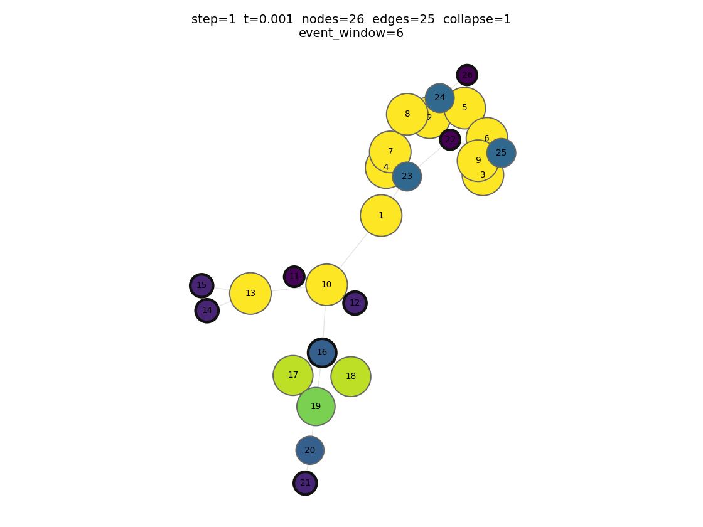
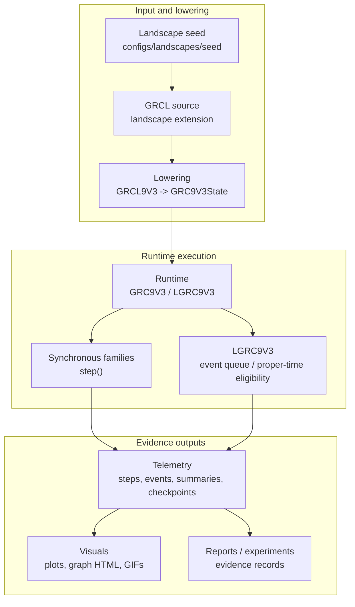

# Graph Reflexive Coherence

Graph Reflexive Coherence studies how structure, regulation, and identity emerge
from reflexive graph interactions, using reproducible graph-native Python models
with landscape lowering, telemetry, visualization, and artifact-backed
experiments.

It is aimed at researchers and implementers working on graph-based dynamical
systems, self-referencing computational models, and reflexive regulation
architectures.

This repository is the graph-native implementation and evidence workspace for
the GRC model family: `GRCV2`, `GRCV3`, `GRC9`, `GRC9V3`, and the event-driven
`LGRC9V3` branch. It combines the `pygrc` Python package with papers, specs,
runnable examples, tests, telemetry and visualization tooling, and the
experiment trail that bounds the current claims.

Use it as:

- a runnable reference for graph/port-graph RC dynamics, landscape lowering,
  telemetry, visualization, and experiment reconstruction;
- an auditable research record for graph-based self-referencing systems, with
  explicit claim boundaries, artifact-backed checks, and staged evidence.

This is not a black-box product or finished solution. It is an invitation to
explore emergent Reflexive Coherence patterns through runnable models,
reproducible artifacts, and explicit claim boundaries. Positive claims are tied
to the papers, specs, tests, experiment reports, and reproducible scripts that
support them.

## Status and maturity

This is an active research implementation, not a stabilized product API. The
core graph runtimes, specs, tests, telemetry, visualization, and example paths
are runnable, while public API boundaries and packaging remain intentionally
conservative.

Current work focuses on how Reflexive Coherence theory appears on discrete
graph substrates: how continuous-field expectations translate into graph and
port-graph dynamics, how substrate choices and implementation details affect
emergent structures, and which patterns survive artifact-backed reconstruction.

The most active frontier is `LGRC9V3`, the event-driven causal-history
substrate. It is used to study packetized coherence transport, delayed handoff,
local proper-time evidence, recurrent pulse circuits, route choice,
memory/trail affordance, goal-proxy regulation, and bounded agentic-like
integration.

The current becoming-primitive handoff moves next to `N28`. The Phase 8
`LGRC9V3` multi-basin formation tranche consumed the closed N25/N25.1 evidence
and closed at `MB5`; the N25.2 validation bridge then closed at `MB6`,
allowing N26 to consume scoped multi-basin substrate evidence. N26 closed
bounded proxy divergence / proxy collapse evidence at `PD6`, and N27 closed
bounded configuration/topology transfer evidence at `CT6` with an N28
side-effect precursor handoff. Unscoped multi-basin substrate consumption,
native support, native AP5, agency, sentience, ant ecology implementation, and
Phase 8 completion remain blocked.

Some experiments use declared producer or policy scaffolding on top of field
dynamics. That hybrid path is intentional: it lowers the gap between current
theory and fully native RC mechanisms while keeping the distinction between
producer-assisted evidence and native coherence-loop evidence explicit.

The long-term goal is a more fully native RC implementation with self-contained
field patterns. Present claims remain bounded by the papers, specs, tests,
telemetry, experiment reports, and committed artifacts that support them.

## Theory and implementation map

The broader Reflexive Coherence theory lives primarily in
[geometric-reflexive-coherence](https://github.com/urosj/geometric-reflexive-coherence).
This repository focuses on graph-native and LGRC implementations. The
`papers/` directory contains graph/LGRC papers and local companion copies needed
to understand this repository's model arc.

For this repository, the most useful reading path is often the implementation
record rather than the paper list alone:

| Entry point | What it explains |
| --- | --- |
| [implementation/ImplementationPhases.md](implementation/ImplementationPhases.md) | Top-level phase map from core substrate through runtimes, telemetry, visualization, landscapes, and LGRC. |
| [specs/README.md](specs/README.md) | Implementation contracts and family capability matrix for `GRCV2`, `GRCV3`, `GRC9`, `GRC9V3`, and `LGRC9V3`. |
| [Phase T implementation plan: telemetry and evidence discipline](implementation/Phase-T-ImplementationPlan.md) | Artifact layout, reports, replay, and evidence discipline. |
| [implementation/Phase-V-ImplementationPlan.md](implementation/Phase-V-ImplementationPlan.md) | Visualization as a downstream consumer of saved telemetry and graph checkpoints. |
| [docs/reference/LandscapeCompiler-ReferenceGuide.md](docs/reference/LandscapeCompiler-ReferenceGuide.md) | Landscape seed and GRCL lowering path into runtime states, telemetry, and visual review. |
| [implementation/Phase-8-LGRC9-ImplementationPlan.md](implementation/Phase-8-LGRC9-ImplementationPlan.md) | Event-driven LGRC substrate, causal-history runtime direction, packet queues, and timing evidence. |

## Current runnable surfaces

| Family | Why it matters | Explore from theory to code |
| --- | --- | --- |
| `GRCV2` | First executable graph RC baseline. It establishes the common model interface, deterministic graph dynamics, budget observables, spark/topology events, persistence, and landscape import path. | Paper: [2025-12-GRC-V2](papers/2025-12-GRC-V2.md)<br>Spec: [grc-v2-spec](specs/grc-v2-spec.md)<br>Implementation: [GRCV2-Closeout](implementation/GRCV2-Closeout.md), [Phase 4 plan](implementation/Phase-4-ImplementationPlan.md)<br>Code: [src/pygrc/models/grc_v2.py](src/pygrc/models/grc_v2.py)<br>Tests: [tests/models/test_grc_v2_step_skeleton.py](tests/models/test_grc_v2_step_skeleton.py) |
| `GRCV3` | Basin-attribute and hierarchy-bearing graph runtime. It is the main bridge from graph RC into richer semantic structure, frontier birth, sparks, differential behavior, and rich landscape seeds. | Paper: [2026-02-GRC-V3](papers/2026-02-GRC-V3.md)<br>Spec: [grc-v3-spec](specs/grc-v3-spec.md)<br>Implementation: [GRCV3-Closeout](implementation/GRCV3-Closeout.md), [GRCV3-Retrospective](implementation/GRCV3-Retrospective.md)<br>Code: [src/pygrc/models/grc_v3.py](src/pygrc/models/grc_v3.py)<br>Tests: [tests/models/test_grc_v3_step.py](tests/models/test_grc_v3_step.py) |
| `GRC9` | Mechanically explicit nine-slot/port-graph substrate. It tests whether RC behavior survives a more local, port-structured substrate instead of a generic weighted graph. | Paper: [2026-04-GRC-9](papers/2026-04-GRC-9.md)<br>Spec: [grc-9-spec](specs/grc-9-spec.md)<br>Implementation: [Phase 6 closeout](implementation/Phase-6-Closeout.md), [GRC9-Retrospective](implementation/GRC9-Retrospective.md)<br>Code: [src/pygrc/models/grc_9.py](src/pygrc/models/grc_9.py)<br>Tests: [tests/models/test_grc_9_step.py](tests/models/test_grc_9_step.py) |
| `GRC9V3` | Hybrid runtime that combines the GRC9 mechanical substrate with GRCV3 semantic lift. It is the main synchronous target for landscape lowering, Lane A/Lane B spark evidence, telemetry, and quickstart visuals. | Papers: [2026-04-GRC-9](papers/2026-04-GRC-9.md), [2026-02-GRC-V3](papers/2026-02-GRC-V3.md)<br>Spec: [grc-9-v3-spec](specs/grc-9-v3-spec.md)<br>Implementation: [Phase 7 closeout](implementation/Phase-7-Closeout.md), [Phase T GRC9V3 closeout](implementation/Phase-T-GRC9V3-Closeout.md)<br>Code: [src/pygrc/models/grc_9_v3.py](src/pygrc/models/grc_9_v3.py)<br>Examples: [examples/grc9v3](examples/grc9v3/README.md), [quickstart](examples/quickstart/README.md) |
| `LGRC9V3` | Event-driven causal-history substrate for packet queues, local proper time, causal pulse transport, native route arbitration, producer-gated continuations, and the current agency-adjacent experiment arc. | Papers: [2026-05-LGRC-9](papers/2026-05-LGRC-9.md), [Native Packet Loops](papers/2026-05-LGRC9V3-Native-Packet-Loops.md), [Causal Pulse Substrate Surfaces](papers/2026-05-LGRC9V3-Causal-Pulse-Substrate-Surfaces.md)<br>Spec: [lgrc-9-v3-spec](specs/lgrc-9-v3-spec.md)<br>Implementation: [Phase 8 plan](implementation/Phase-8-LGRC9-ImplementationPlan.md), [Phase 8 closeout](implementation/Phase-8-LGRC9-Closeout.md)<br>Code: [src/pygrc/models/lgrc_9_v3.py](src/pygrc/models/lgrc_9_v3.py)<br>Examples: [examples/lgrc9v3](examples/lgrc9v3/README.md) |

Shared workflow surfaces compose with those model families:

| Surface | Start with | What is runnable |
| --- | --- | --- |
| First-contact workflows | [examples/README.md](examples/README.md), [examples/quickstart/README.md](examples/quickstart/README.md) | Source-tree scripts that construct models, run steps, capture telemetry, and render outputs. |
| Landscape and GRCL lowering | [examples/landscapes/README.md](examples/landscapes/README.md), [docs/reference/LandscapeCompiler-ReferenceGuide.md](docs/reference/LandscapeCompiler-ReferenceGuide.md) | Seed loading, validation, lowering, inference, motion surfaces, and replay into runtime states. |
| Telemetry and visualization | [docs/reference/Telemetry-ReferenceGuide.md](docs/reference/Telemetry-ReferenceGuide.md), [docs/reference/GraphVisualization-ReferenceGuide.md](docs/reference/GraphVisualization-ReferenceGuide.md) | Step/event rows, run summaries, checkpoints, graph rendering, visual bundles, and evidence catalogs. |
| Experiment reconstruction | `experiments/*/README.md` | Experiment-local scripts, configs, reports, and selected outputs for reconstructing historical evidence lanes. |

## Quick start

Requirements:

- Python 3.11 or newer.
- A local virtual environment is recommended.

```bash
python -m venv .venv
source .venv/bin/activate
python -m pip install -r requirements-dev.txt
python -m unittest discover -s tests -p 'test_*.py'
```

For direct source-tree execution without installing the package first, prefix
commands with `PYTHONPATH=src`.

The fastest first-contact example is:

```bash
PYTHONPATH=src ./.venv/bin/python examples/quickstart/spark_a_cell.py
```

This loads a rich landscape seed, lowers it into `GRC9V3`, runs one step,
captures telemetry, and renders visual outputs under `outputs/examples/`.

[](docs/assets/quickstart-graph-animation.gif)

The tracked image above is the final quickstart frame. Select it to open the
generated animation. Both assets were generated from the command in this
section and copied from `outputs/examples/quickstart/spark_a_cell/visualization/`.

## Minimal API example

This is the same seed-to-`GRC9V3` path used by the quickstart, reduced to model
construction and one step:

```python
from pathlib import Path

from pygrc.landscapes import load_landscape_seed, validate_landscape_seed
from pygrc.landscapes.extensions.grcl9v3 import (
    compile_grcl9v3_landscape_example_to_source,
    extract_grcl9v3_landscape_example_from_seed,
)
from pygrc.models import GRC9V3, lower_grcl9v3_source_to_grc9v3_state


seed_path = Path(
    "configs/landscapes/seed/grcl9v3-corrected-hybrid-full-composition.seed.yaml"
)
seed = load_landscape_seed(seed_path)
validate_landscape_seed(seed)

example = extract_grcl9v3_landscape_example_from_seed(seed, seed_path=seed_path)
if example is None:
    raise RuntimeError(f"{seed_path} does not declare a GRCL9V3 example")

source = compile_grcl9v3_landscape_example_to_source(example)
config = {"dt": seed.constitutive_profile.dt}
lowering = lower_grcl9v3_source_to_grc9v3_state(source, params=config)
model = GRC9V3.from_state(lowering.state, config)

result = model.step()
print(result.step_index, result.time, [event.kind for event in result.events])
```

## Execution and evidence flow



The input/lowering row is optional. It is used when a run should be authored in
landscape or Morse-theoretic terms and then lowered into a graph runtime. Direct
graph-state construction through the model APIs is also supported.

## Repository map

- `papers/`: graph and LGRC paper set, plus selected bridge papers needed to
  understand the graph arc.
- `src/pygrc/`: Python package implementation.
- `specs/`: implementation contracts for model families and integration
  surfaces.
- `docs/`: operator-facing reference guides and status notes.
- `examples/`: runnable first-contact and workflow examples.
- `experiments/`: experiment plans, scripts, configs, reports, and historical
  evidence records.
- `implementation/`: engineering plans, checklists, handoffs, closeouts, and
  phase history.
- `configs/`: reusable landscape and seed fixtures.
- `tests/`: unit, integration, telemetry, landscape, model, and smoke tests.

Top-level scratch artifacts under `outputs/` are ignored. Experiment-local
outputs under `experiments/**/outputs/` are part of the historical evidence
record when they are committed. These artifacts should use relative paths only;
rerun or sanitize any output that contains machine-local absolute paths before
publication.

## Related repositories

| Repository | Role |
| --- | --- |
| [geometric-reflexive-coherence](https://github.com/urosj/geometric-reflexive-coherence) | Active geometric/theory papers and substrate-level Reflexive Coherence work. |
| [geometric-reflexive-coherence/substrates](https://github.com/urosj/geometric-reflexive-coherence/tree/main/substrates) | Related substrate work that connects geometric RC with graph/mechanical surfaces. |
| [reflexive-coherence-sim](https://github.com/urosj/reflexive-coherence-sim) | PDE/voxel simulation code, experiment logs, policies, schemas, and reproducibility work. |
| [reflexive-coherence-agentic-protocol](https://github.com/urosj/reflexive-coherence-agentic-protocol) | Agentic protocol and method-layer operationalization. |
| [reflexive-organism-model](https://github.com/urosj/reflexive-organism-model) | Historical origin and ROM-specific explorations. |

Use this repository for graph-native RC models, PyGRC code, graph experiment
scripts, graph/LGRC evidence, and graph-specific documentation. Use the related
repositories for their own scopes instead of moving all Reflexive Coherence work
into this repository.

## Reproducibility and artifacts

The repository separates runnable scratch output from committed evidence. The
goal is to let readers rerun examples and inspect historical experiment paths
without committing machine-local state.

| Path | Role | Commit policy |
| --- | --- | --- |
| `outputs/examples/` | Local output from quickstarts and examples. | Ignored scratch output; regenerate from documented commands. |
| `docs/assets/` | Public README/documentation visuals. | Tracked only when generated from a documented command or intentionally curated. |
| `experiments/**/outputs/` | Historical experiment evidence selected for public inspection. | May be committed; must use relative paths and avoid machine-local state. |
| `outputs/grc9v3/...` | Curated top-level evidence exceptions. | Tracked only when explicitly unignored in `.gitignore`. |

Claim boundaries should be read through evidence pointers, not through README
summaries alone:

The table below maps each positive claim in this repository to supporting
evidence and states what the claim does not assert.

| Bounded claim | Evidence pointers | Non-claim |
| --- | --- | --- |
| The graph model families are executable reference runtimes. | [specs/README.md](specs/README.md), [src/pygrc/models](src/pygrc/models), [tests/models](tests/models), [docs/reference/GRC-Runtime-ReferenceGuide.md](docs/reference/GRC-Runtime-ReferenceGuide.md) | Stable black-box product API. |
| A landscape-authored seed can be lowered into `GRC9V3`, stepped, captured, and rendered. | [examples/quickstart/spark_a_cell.py](examples/quickstart/spark_a_cell.py), [tests/smoke/test_quickstart.py](tests/smoke/test_quickstart.py), [configs/landscapes/seed/grcl9v3-corrected-hybrid-full-composition.seed.yaml](configs/landscapes/seed/grcl9v3-corrected-hybrid-full-composition.seed.yaml), [docs/assets/quickstart-graph-final.png](docs/assets/quickstart-graph-final.png) | Proof of a complete agent architecture. |
| Telemetry, checkpoints, and visualization are evidence consumers over runtime artifacts. | [implementation/Phase-T-ImplementationPlan.md](implementation/Phase-T-ImplementationPlan.md), [implementation/Phase-V-ImplementationPlan.md](implementation/Phase-V-ImplementationPlan.md), [docs/reference/Telemetry-ReferenceGuide.md](docs/reference/Telemetry-ReferenceGuide.md), [docs/reference/GraphVisualization-ReferenceGuide.md](docs/reference/GraphVisualization-ReferenceGuide.md), [tests/visualization](tests/visualization) | Visual inspection as an independent proof layer. |
| `LGRC9V3` supports executable causal-history surfaces and packet/event queue experiments. | [papers/2026-05-LGRC-9.md](papers/2026-05-LGRC-9.md), [specs/lgrc-9-v3-spec.md](specs/lgrc-9-v3-spec.md), [implementation/Phase-8-LGRC9-Closeout.md](implementation/Phase-8-LGRC9-Closeout.md), [examples/lgrc9v3](examples/lgrc9v3/README.md), [tests/models/test_lgrc_9_v3_runtime.py](tests/models/test_lgrc_9_v3_runtime.py) | General agency, intention, biological identity, or personhood. |
| N05-N11 record a bounded LGRC agentic-like foundation arc with explicit claim ceilings. | [experiments/N05-N11-LGRC-AgenticLikeFoundationRoadmap.md](experiments/N05-N11-LGRC-AgenticLikeFoundationRoadmap.md), [experiments/2026-05-N10-lgrc-agentic-like-integration/README.md](experiments/2026-05-N10-lgrc-agentic-like-integration/README.md), [experiments/2026-05-N11-lgrc-general-agentic-like-integration/README.md](experiments/2026-05-N11-lgrc-general-agentic-like-integration/README.md), [experiments/2026-05-N11-lgrc-general-agentic-like-integration/scripts/build_n11_iteration_12_final_closeout_and_handoff.py](experiments/2026-05-N11-lgrc-general-agentic-like-integration/scripts/build_n11_iteration_12_final_closeout_and_handoff.py), [experiments/2026-05-N11-lgrc-general-agentic-like-integration/outputs/n11_iteration_12_final_closeout_and_handoff.json](experiments/2026-05-N11-lgrc-general-agentic-like-integration/outputs/n11_iteration_12_final_closeout_and_handoff.json) | Unbounded agency or hidden-steering-free native general intelligence. |
| N12-N19 close the artifact-level agency-prerequisite and native-readiness review stack, with AP4/AP5 NAT4 gaps still blocking full native ladder generation. | [experiments/README.md](experiments/README.md), [experiments/N12-N18-LGRC-AgencyPrerequisitesRoadmap.md](experiments/N12-N18-LGRC-AgencyPrerequisitesRoadmap.md), [experiments/N12-N18-LGRC-AgencyPrerequisitesHandoff.md](experiments/N12-N18-LGRC-AgencyPrerequisitesHandoff.md), [experiments/2026-06-N19-lgrc-native-naturalization-review-ap3-ap8/outputs/n19_closeout_and_handoff.json](experiments/2026-06-N19-lgrc-native-naturalization-review-ap3-ap8/outputs/n19_closeout_and_handoff.json), [experiments/2026-06-N19-lgrc-native-naturalization-review-ap3-ap8/reports/n19_closeout_and_handoff.md](experiments/2026-06-N19-lgrc-native-naturalization-review-ap3-ap8/reports/n19_closeout_and_handoff.md) | Full AP3-AP8 native ladder generation, agency, native support, Phase 8 implementation, identity acceptance, or unrestricted autonomy. |
| N20-N27 close the current becoming-primitive arc through scoped BF5 high-margin core / sub-basin formation, Phase 8 MB6 validation, bounded PD6 proxy divergence / proxy collapse, and bounded CT6 configuration/topology transfer with an N28 precursor handoff. | [experiments/N20-N29-LGRC-BecomingAgencyEcologyRoadmap.md](experiments/N20-N29-LGRC-BecomingAgencyEcologyRoadmap.md), [experiments/N20-N29-LGRC-BecomingAgencyEcologyHandoff.md](experiments/N20-N29-LGRC-BecomingAgencyEcologyHandoff.md), [experiments/2026-06-N20-lgrc-becoming-primitive-producer-translation-contract/README.md](experiments/2026-06-N20-lgrc-becoming-primitive-producer-translation-contract/README.md), [experiments/2026-06-N21-lgrc-withdrawal-resistance-and-naturalization-depth/README.md](experiments/2026-06-N21-lgrc-withdrawal-resistance-and-naturalization-depth/README.md), [experiments/2026-06-N22-lgrc-susceptibility-update-durable-geometry-modification/README.md](experiments/2026-06-N22-lgrc-susceptibility-update-durable-geometry-modification/README.md), [experiments/2026-06-N23-lgrc-live-continuation-collapse-selection-geometry/README.md](experiments/2026-06-N23-lgrc-live-continuation-collapse-selection-geometry/README.md), [experiments/2026-06-N24-lgrc-abundance-surplus-supported-optionality/README.md](experiments/2026-06-N24-lgrc-abundance-surplus-supported-optionality/README.md), [experiments/2026-06-N25-lgrc-spark-sub-basin-new-basin-formation/README.md](experiments/2026-06-N25-lgrc-spark-sub-basin-new-basin-formation/README.md), [experiments/2026-06-N25.1-lgrc9v3-multi-basin-formation-extension-requirements/README.md](experiments/2026-06-N25.1-lgrc9v3-multi-basin-formation-extension-requirements/README.md), [experiments/2026-06-N25.2-lgrc9v3-mb6-validation-bridge/reports/n25_2_closeout_and_n26_handoff.md](experiments/2026-06-N25.2-lgrc9v3-mb6-validation-bridge/reports/n25_2_closeout_and_n26_handoff.md), [experiments/2026-06-N26-lgrc-proxy-divergence-proxy-collapse/README.md](experiments/2026-06-N26-lgrc-proxy-divergence-proxy-collapse/README.md), [experiments/2026-06-N27-lgrc-configuration-substrate-transfer/README.md](experiments/2026-06-N27-lgrc-configuration-substrate-transfer/README.md), [implementation/Phase-8-LGRC9-MultiBasinFormationCloseout.md](implementation/Phase-8-LGRC9-MultiBasinFormationCloseout.md) | N28 generative persistence evidence, N26-ready unscoped multi-basin substrate evidence, BF6 as general native multi-basin formation, native AP5, native support, semantic learning, semantic choice, agency, sentience, ant ecology implementation, Phase 8 completion, or unrestricted autonomy. |

To reproduce the quickstart visual, run:

```bash
PYTHONPATH=src ./.venv/bin/python examples/quickstart/spark_a_cell.py
```

To reproduce an experiment, start with [experiments/README.md](experiments/README.md),
then follow the selected experiment `README.md`, `implementation/`, `scripts/`,
`reports/`, and source artifact references. Most experiment scripts write fresh
scratch output under top-level `outputs/` or evidence output under the local
experiment `outputs/` directory.

Committed evidence artifacts are part of the public research record. Rerun or
sanitize any output that contains machine-local absolute paths before
publication.

If a documented reconstruction path fails, open an issue with the command, the
environment, and the missing or mismatched artifact reference.

## Development

`pygrc` is source-installable for this publication pass. There is no tagged
package release path yet; install from the repository checkout. See
[RELEASE-NOTES.md](RELEASE-NOTES.md) for the first public GitHub snapshot
notes.

Public imports should prefer package facades rather than deep implementation
modules:

| Import path | Current role |
| --- | --- |
| `pygrc.core` | Shared model interfaces, params, graph backends, events, snapshots. |
| `pygrc.models` | Runtime model families, states, lowering adapters. |
| `pygrc.landscapes` | Landscape seeds, validation, GRCL/PDE bridges, inference. |
| `pygrc.telemetry` | Artifact capture, contracts, reports, replay helpers. |
| `pygrc.visualization` | Artifact-driven plot and graph rendering helpers. |
| `pygrc.integrations` | Adapter-boundary contracts for host/tool interop. |

`pygrc.discovery` and `pygrc.cli` are importable research/tooling surfaces, but
they are not root-facade exports. Direct deep imports from implementation
modules are research-workspace details unless they are used by an example,
spec, or reference guide.

Useful commands:

```bash
python -m unittest discover -s tests -p 'test_*.py'
python -m ruff check src tests
python -m mypy src tests
```

The full test suite may take longer than a quick smoke check. For first-pass
confidence, run the tests covering the surface you touched plus at least the
import smoke tests.

## Contribution scope

Contributions should be graph-RC specific: papers, specs, code, examples,
tests, documentation, landscape fixtures, graph/LGRC experiments, and
reproducibility fixes for this repository.

Use the related repositories for non-graph theory, PDE/voxel simulation,
agentic-protocol work, or Reflexive Organism Model-specific material. See
[CONTRIBUTING.md](CONTRIBUTING.md) for details.

## Citation

If this repository, the papers, or `pygrc` influence your work, cite
[CITATION.cff](CITATION.cff) and also cite the specific paper, spec, experiment
lane, report, or artifact you used. Implementation claims in this repository
are usually tied to a particular evidence lane, not to the repository metadata
alone.

## License

This repository is mixed-license:

| Content | License |
| --- | --- |
| `papers/` | CC BY-SA 4.0; these are imported theory papers kept here for self-contained reading, and the files carry explicit copyright/license headers. |
| Everything else, including `src/pygrc/`, tests, examples, scripts, `docs/`, `specs/`, `implementation/`, `experiments/`, and generated evidence artifacts | GPL-2.0-only unless a file states otherwise; see [LICENSE](LICENSE) and `pyproject.toml`. |
