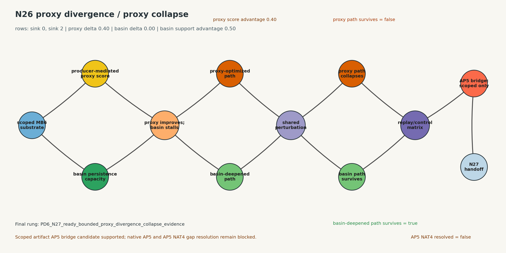
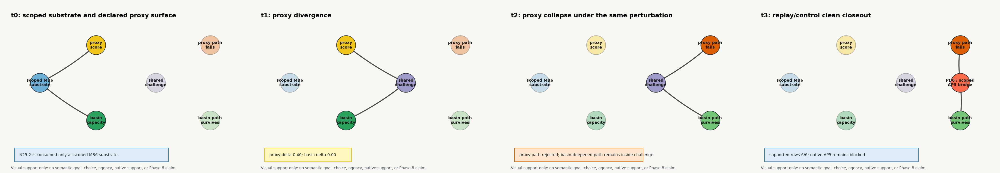

# N26 - LGRC Proxy Divergence / Proxy Collapse

N26 is the first experiment after the scoped MB6 multi-basin substrate handoff.
It consumes the N20 `proxy_divergence_proxy_collapse` contract and the N25.2
closeout only as scoped multi-basin substrate evidence, then tests whether a
proxy metric can diverge from basin deepening and whether proxy-optimized
success collapses under perturbation where a basin-deepened path survives.

Current state:

```text
status = closed
source_contract_row = n20_i4_row_07_proxy_divergence_proxy_collapse
source_consumable_contract_row = n20_i5_row_07_proxy_divergence_proxy_collapse
n20_contract_status = complete
n25_2_consumption = scoped_MB6_multi_basin_substrate_evidence_only
n25_2_unscoped_consumption_allowed = false
target_primitive = proxy_divergence_proxy_collapse
target_reading = proxy divergence / proxy collapse
local_ladder = PD0...PD6
closeout_ladder = N26-C0...N26-C6
final_supported_pd_ladder_rung = PD6_N27_ready_bounded_proxy_divergence_collapse_evidence
final_n26_closeout_rung = N26-C6_N27_ready_bounded_proxy_divergence_collapse_closeout
positive_proxy_evidence_opened = true
controlled_proxy_divergence_supported = true
controlled_proxy_collapse_supported = true
scoped_artifact_ap5_bridge_candidate_supported = true
native_ap5_bridge_supported = false
ap5_nat4_gap_resolved = false
final_n26_supported = true
ready_for_n27 = true
```

Core question:

```text
Can proxy improvement diverge from basin deepening?
```

LGRC readings:

```text
proxy divergence =
  proxy metric improves while basin persistence capacity stalls or degrades

proxy collapse =
  proxy-optimized success fails under a perturbation that basin-deepened
  success would survive
```

N26 is not a semantic goal, intention, agency, sentience, native support,
identity, organism/life, ant-ecology, or Phase 8 experiment.

## Source Boundary

Primary source artifacts:

```text
experiments/2026-06-N20-lgrc-becoming-primitive-producer-translation-contract/outputs/n20_native_function_proxy_contract.json
experiments/2026-06-N20-lgrc-becoming-primitive-producer-translation-contract/outputs/n20_same_basin_continuation_contract.json
experiments/2026-06-N15-lgrc-endogenous-proxy-formation/outputs/n15_closeout_and_handoff.json
experiments/2026-06-N19-lgrc-native-naturalization-review-ap3-ap8/outputs/n19_candidate_classification_matrix.json
experiments/2026-06-N19-lgrc-native-naturalization-review-ap3-ap8/outputs/n19_closeout_and_handoff.json
experiments/2026-06-N25-lgrc-spark-sub-basin-new-basin-formation/outputs/n25_closeout_and_n26_handoff.json
experiments/2026-06-N25.1-lgrc9v3-multi-basin-formation-extension-requirements/outputs/n25_1_closeout_and_phase8_extension_handoff.json
experiments/2026-06-N25.2-lgrc9v3-mb6-validation-bridge/outputs/n25_2_closeout_and_n26_handoff.json
experiments/N20-N29-LGRC-BecomingAgencyEcologyHandoff.md
experiments/N20-N29-LGRC-BecomingAgencyEcologyRoadmap.md
```

N26 may consume:

```text
N20 proxy divergence / proxy collapse contract
N25 bounded sub-basin / high-margin core context
N25.1 multi-basin extension requirements context
N25.2 scoped MB6 multi-basin substrate evidence
N15 AP5 gap record as historical gap context
N19 AP5/NAT3 gap boundary as current classification context
```

N26 must not consume any source as:

```text
semantic goal
semantic target ownership
semantic choice
agency
native support
identity acceptance
sentience
ant ecology implementation
unscoped multi-basin substrate
Phase 8 completion
```

## Required Source-Current Fields

Positive N26 rows must provide source-current evidence for:

```text
source_current_inputs
source_contract_row_digest
source_consumable_contract_row_digest
source_output_digest
run_artifact_id
runtime_config_digest
artifact_manifest
all_artifact_sha256_match_file_contents
row_specific_thresholds_declared_before_use
scoped_mb6_substrate_consumption_record
multi_basin_scope_id
basin_ids_or_child_basin_ids
n25_2_unscoped_consumption_allowed
n25_2_unscoped_multi_basin_consumption_allowed
front_capacity_companion_backfill_used
proxy_metric_definition_digest
proxy_derivation_policy_digest
proxy_target_digest_declared_before_use
proxy_policy_owner
producer_mediated_target_derivation_counted_as_substrate
lower_stack_input_trace
proxy_metric_trace
basin_persistence_capacity_trace
support_coherence_floor_trace
basin_deepening_comparison_trace
proxy_vs_basin_delta_trace
proxy_optimized_path_trace
basin_deepened_path_trace
perturbation_challenge_trace
proxy_collapse_result_trace
peer_or_control_basin_trace
replay_result
control_results
ap5_dependency_status
ap5_condition_reason
claim_ceiling
unsafe_claim_flags
```

## Local Ladder

```text
PD0 = no source-current proxy evidence
PD1 = proxy metric present, but not source-current or not lower-stack linked
PD2 = source-current proxy derivation candidate with target digest declared before use
PD3 = replay-backed proxy / basin contrast candidate
PD4 = controlled proxy divergence candidate
PD5 = controlled proxy collapse candidate
PD6 = N27-ready bounded proxy divergence / collapse evidence with scoped AP5 bridge candidate
```

Rows below `PD4` cannot support proxy divergence. Rows below `PD5` cannot
support proxy collapse. `PD6` is a handoff rung, not an agency claim.

Closeout ladder:

```text
N26-C0 = initialized contract only
N26-C1 = source inventory and scoped-substrate admission passed
N26-C2 = proxy divergence / collapse schema frozen
N26-C3 = active nulls fail closed
N26-C4 = source-current proxy derivation and replay-backed contrast supported
N26-C5 = controlled proxy divergence / collapse candidate supported
N26-C6 = N27-ready bounded proxy divergence / collapse closeout
```

## Supporting Visualization

N26 includes a supporting explanatory visualization generated from the I5-C,
I6, I7, and I8 source artifacts:

| Static image linked to animation | Sequence image |
| --- | --- |
| [](outputs/n26_proxy_divergence_collapse_visualization/n26_proxy_divergence_collapse_animation.gif) | [](outputs/n26_proxy_divergence_collapse_visualization/n26_proxy_divergence_collapse_sequence.png) |

The graph shows the source-backed contrast: proxy score increases while basin
persistence capacity stalls, then the proxy-optimized path fails under the same
perturbation where the basin-deepened path survives. This visual is an
inspection aid only; it does not add evidence beyond the JSON artifacts and
does not support native AP5, AP5 NAT4 gap resolution, semantic goal, choice,
agency, native support, sentience, Phase 8 completion, ant ecology, or
unscoped multi-basin substrate.

## Claim Boundary

Allowed maximum claim after successful closeout:

```text
bounded artifact-level proxy divergence / proxy collapse evidence on scoped
multi-basin LGRC substrate, with AP5 bridge candidate status and unsafe
promotions blocked
```

Blocked claims:

```text
semantic goal
semantic target ownership
semantic choice
semantic learning
agency
native support
selfhood
identity acceptance
sentience
organism/life
ant ecology implementation
Phase 8 completion
unscoped multi-basin substrate
```

## Initial Expected Structure

```text
Iteration 1 - Source Inventory And Scoped Substrate Admission
Iteration 2 - Proxy Divergence / Collapse Schema Freeze
Iteration 3 - Active Nulls And Failure Baselines
Iteration 4 - Source-Current Proxy Derivation Probe
Iteration 4-A - Proxy Derivation Sensitivity Probe
Iteration 5 - Proxy Divergence Contrast Matrix
Iteration 5-A - Alternative Proxy Surface Divergence Probe
Iteration 5-B - Fixed-Surface Divergence Search
Iteration 5-C - Same-Route Score-Dose Divergence Probe
Iteration 6 - Proxy Collapse Perturbation Matrix
Iteration 7 - Replay, Controls, And AP5 Classification Gate
Iteration 8 - Closeout And N27 Handoff
```
