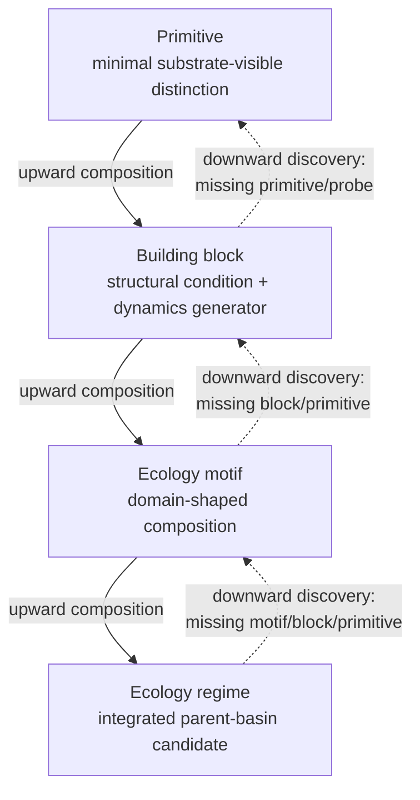

# N30+ Experiment Catalog Roadmap
## Primitives, Building Blocks, Motifs, and Regimes for Shared-Medium Agentic Ecology

## 0. Purpose of this roadmap

This roadmap defines the experiment ontology for the next phase after the initial LGRC catalog established by N05-N29.

It is not primarily a schedule of experiments. It does not prescribe that N30 must do one exact thing, N31 another exact thing, and so on. Individual experiments should still define their own hypotheses, artifacts, runtime fields, controls, admission gates, and claim ceilings.

The purpose of this roadmap is different:

- to give future experiments a shared vocabulary;
- to explain what is meant by primitive, building block, ecology motif, and ecology regime;
- to explain why those layers are needed;
- to define how an experiment should position its result inside the catalog;
- to make clear how evidence, debt, blocked relabels, failure modes, and claim boundaries should be handled;
- to orient N30+ toward shared-medium agentic ecology without prematurely claiming agency, communication, cooperation, life, consciousness, or full ecological regimes.

The roadmap begins from the N05-N29 sequence as an initial catalog, not as an insufficient or failed phase. N05-N29 produced the first atlas of LGRC-visible primitives, bridge contracts, claim boundaries, and evidence habits. N30+ continues from that atlas and defines how future experiments can expand, refine, compose, and evaluate catalog entries.

The main direction is:

```text
primitive → building block → ecology motif → ecology regime
```

These layers are defined comparatively in [The catalog hierarchy](#4-the-catalog-hierarchy).

But this is not a one-way ladder. The catalog is a bidirectional research grammar:

```text
upward composition:
primitive → building block → motif → regime

downward discovery:
failed regime/motif/block → missing building block → missing primitive → new probe
```

Future experiments should be allowed to discover new primitives when attempting to form new building blocks. Building-block experiments may reveal motif candidates. Motif experiments may reveal regime-like behavior. But each experiment should clearly state its primary catalog layer and avoid promoting a result beyond the evidence it actually contains.

---

## Table of contents

- [0. Purpose of this roadmap](#0-purpose-of-this-roadmap)
- [Source basis and consumption rules](#source-basis-and-consumption-rules)
- [Normative language](#normative-language)
- [Substrate primer / glossary](#substrate-primer--glossary)
- [How to read this document](#how-to-read-this-document)
- [1. Background: from N05-N29 to N30+](#1-background-from-n05-n29-to-n30)
- [2. The conceptual shift: from behavior scripting to substrate conditions](#2-the-conceptual-shift-from-behavior-scripting-to-substrate-conditions)
- [3. Core terms](#3-core-terms)
- [4. The catalog hierarchy](#4-the-catalog-hierarchy)
- [5. Layer 1: primitives](#5-layer-1-primitives)
- [6. Layer 2: building blocks](#6-layer-2-building-blocks)
- [7. Layer 3: ecology motifs](#7-layer-3-ecology-motifs)
- [8. Layer 4: ecology regimes](#8-layer-4-ecology-regimes)
- [9. Shared-medium ontology](#9-shared-medium-ontology)
- [10. Debt taxonomy](#10-debt-taxonomy)
- [11. Failure taxonomy](#11-failure-taxonomy)
- [12. Composition rules](#12-composition-rules)
- [13. Claim-boundary policy](#13-claim-boundary-policy)
- [14. How future experiments should position themselves](#14-how-future-experiments-should-position-themselves)
- [15. Evaluation checklist](#15-evaluation-checklist)
- [16. How this prepares agentic ecology](#16-how-this-prepares-agentic-ecology)
- [17. Candidate N30+ directions](#17-candidate-n30-directions)
- [18. Closing orientation](#18-closing-orientation)
- [Appendix A. N30 Direction Refinement](#appendix-a-n30-direction-refinement)
- [Appendix B. Cross-Project Spiral After N30](#appendix-b-cross-project-spiral-after-n30)
- [Appendix C. N30 Closeout Update](#appendix-c-n30-closeout-update)
- [Appendix D. N31 Downward-Discovery Return](#appendix-d-n31-downward-discovery-return)

---

## Source basis and consumption rules

This roadmap is not itself the evidence base for N30+.

It summarizes and organizes the experiment catalog after N05-N29, but any
future N30+ evidence claim must consume the relevant source artifacts directly.
In particular, future experiments should cite and inspect:

- [N29 closeout and ecology handoff](2026-06-N29-lgrc-agentic-ecology-convergence-bridge/reports/n29_closeout_and_ecology_handoff_i18.md);
- [N29 structured closeout JSON](2026-06-N29-lgrc-agentic-ecology-convergence-bridge/outputs/n29_closeout_and_ecology_handoff_i18.json);
- [N20-N29 roadmap](N20-N29-LGRC-BecomingAgencyEcologyRoadmap.md);
- [N20-N29 handoff](N20-N29-LGRC-BecomingAgencyEcologyHandoff.md);
- the relevant per-experiment source artifacts, reports, replay records, and controls;
- [Claim Boundary Index](../docs/reference/ClaimBoundaryIndex.md).

The roadmap may define vocabulary, catalog positioning rules, and proposed
future directions. It does not replace source artifacts, runtime JSON, reports,
replay evidence, controls, or claim-boundary documents.

Rule:

```text
Do not cite this roadmap as the sole basis for a primitive, building block,
motif, or regime claim.
Consume the source experiment artifacts that established the relevant evidence
boundary.
```

---

## Normative language

This roadmap is directional, not a controlled template.

- **Must / must not / blocked** is reserved for evidence-claim boundaries:
  source use, claim ceilings, blocked relabels, and cases where a stronger
  claim would otherwise be overpromoted.
- **Should / recommended** names the default design discipline, schema shape,
  or roadmap convention. A future experiment may deviate if the deviation is
  declared and does not inflate the claim.
- **May / optional** means an allowed path, not an admission requirement.

When a section uses `must`, read it as claim hygiene: the stronger claim is not
admissible unless the evidence boundary is satisfied. When a section uses
`should`, read it as guidance for clear experiment design, not bureaucracy.

---

## Substrate primer / glossary

This roadmap assumes the graph/LGRC substrate vocabulary developed by earlier
experiments. The short definitions below are only local orientation. For full
implementation and claim boundaries, use the [Claim Boundary Index](../docs/reference/ClaimBoundaryIndex.md),
the [GRC runtime reference](../docs/reference/GRC-Runtime-ReferenceGuide.md),
and the relevant experiment artifacts.

| Term | Local meaning in this roadmap |
|---|---|
| **RC** | Reflexive Coherence: the theory frame in which coherence shapes geometry, geometry shapes flux, and flux updates coherence. |
| **LGRC** | Local / graph Reflexive Coherence runtime family used by this repository for executable graph-native RC experiments. |
| **Basin** | A coherence-stable region or identity-like attractor in the substrate. A basin is not automatically an agent or self. |
| **Coherence** | The substrate quantity tracked by the runtime as the local field/continuity state. It is the basis for many support, basin, and flow claims. |
| **Flux** | Coherence-costly movement, pressure, packet transport, or coupling across graph structure. |
| **Support** | A substrate condition or metric that helps a basin remain above its declared persistence floor. |
| **Susceptibility** | A source-current change in how a route, region, or basin responds to later interaction. |
| **Conductance** | A route or medium property that affects how flux can pass or be biased by prior activity. |
| **Producer** | Explicit code or scaffolding that introduces, schedules, routes, or preserves a quantity not yet carried natively by the substrate. Producer residue is debt, not the agent. |
| **Packet** | Runtime event/transport unit used by LGRC9V3-style causal-history and packet-loop surfaces. |
| **Ghost geometry** | Residual geometry or aftereffect left by a dissolved/inactive basin that may affect future eligibility or reactivation. |
| **Topology lineage** | Runtime history of graph/topology changes such as basin birth, extraction, reabsorption, or boundary change. |
| **Proper-time surface** | Local timing/lineage evidence surface used to separate ordered runtime dependence from post-hoc event stitching. |
| **AP4/AP5** | Earlier agency-prerequisite levels for consequence-sensitive selection and endogenous proxy formation. |
| **NAT4** | Native-readiness classification level used in N19; AP4/AP5 NAT4 gaps remain carried-forward blockers unless explicitly closed. |
| **RC-Agentic-Ecology** | The companion theory/specification project that translates agent, state, message, and ecology language into RC substrate terms. |

Relationship sketch:

```text
coherence -> basin geometry / support / susceptibility
basin geometry + conductance -> flux / packet movement
flux, packets, and events -> aftereffects / topology lineage / ghost geometry
aftereffects and lineage -> later source-current eligibility
```

This sketch is only orientation. It does not replace the RC theory documents,
runtime references, or source experiment artifacts.

---

## How to read this document

This roadmap can be read from several entry points:

- **New readers** should start with the [Substrate primer / glossary](#substrate-primer--glossary), then read [Purpose](#0-purpose-of-this-roadmap), [Core terms](#3-core-terms), and [The catalog hierarchy](#4-the-catalog-hierarchy).
- **Experiment designers** should read the [Source basis and consumption rules](#source-basis-and-consumption-rules), [Normative language](#normative-language), the layer relevant to their experiment, and then [How future experiments should position themselves](#14-how-future-experiments-should-position-themselves) plus the [Evaluation checklist](#15-evaluation-checklist).
- **Claim reviewers** should start with the [Layer claim-risk map](#layer-claim-risk-map), [Claim-boundary policy](#13-claim-boundary-policy), and the [Source basis and consumption rules](#source-basis-and-consumption-rules).
- **Candidate planners** should use [Candidate N30+ directions](#17-candidate-n30-directions) as an index and then read the companion [N30+ Candidate Directions](N30_plus_candidate_directions.md).

---

## 1. Background: from N05-N29 to N30+

The N05-N29 experiments can be read as the initial LGRC experiment catalog.

They did not prove general agency or full ecology. They instead exposed a series of substrate-visible capacities, constraints, and evidence patterns that make later agentic ecology work possible.

A useful way to summarize the arc is:

- **N05-N11** explored early LGRC agentic-like foundations: coherence waves, route choice surfaces, support and identity anchors, memory/trail affordances, regulation, and bounded integration-like behavior.
- **N12-N19** explored agency prerequisites and native-readiness questions: support-seeking regulation, consequence-sensitive selection, endogenous proxy formation, self/environment boundary, action-perception loops, and longer-horizon closure.
- **N20-N29** shifted toward becoming and ecology bridge primitives: withdrawal resistance, naturalization depth, durable susceptibility update, live-continuation collapse, surplus-supported optionality, multi-basin formation, proxy divergence/collapse, configuration transfer, and generative/extractive persistence.
- **N29** became the bridge from the primitive atlas toward agentic ecology: what can be carried forward, what remains producer debt, what needs medium naturalization, and what future catalog entries may be needed.

The central lesson is not that the previous experiments were incomplete. The central lesson is that the initial catalog now makes a new kind of experiment possible.

Earlier experiments often asked mechanism-first questions:

```text
Can X happen in LGRC?
What evidence supports X?
What controls block overclaiming X?
```

N30+ should increasingly ask catalog-grammar questions:

```text
What kind of substrate-visible distinction is this?
Is it a primitive, building block, motif, or regime candidate?
What structural condition makes it possible?
What dynamics does that condition generate?
What evidence envelope admits it?
What debt remains?
How can it compose with other entries?
```

This is the transition from testing isolated mechanisms to developing a catalog of reusable conditions for shared-medium agentic ecology.

---

## 2. The conceptual shift: from behavior scripting to substrate conditions

A key idea behind this roadmap is that future ecology experiments should not
treat scripted ecological behavior as evidence by itself.

The unsafe direction is:

```text
Choose an ecological story.
Write producers or rules that make the story happen.
Name the result communication, cooperation, ecology, or agency.
```

This does not forbid worked examples, domain stories, or producer-mediated
prototypes. The RC-Agentic-Ecology material uses ants, forests, traces, roles,
messages, and coordination as translation targets. That is compatible with this
roadmap when the story is treated as a design seed rather than as evidence, and
when any producer or message scaffold is recorded as debt.

Allowed use:

```text
Choose an ecological target pattern.
Translate its roles and relations into substrate conditions.
Declare any producer/message scaffold and its debt.
Test whether the substrate-visible condition carries the relevant dynamics.
Only then assign a bounded catalog layer and claim ceiling.
```

The LGRC direction is:

```text
Identify a substrate-visible structural condition.
Show what class of dynamics becomes eligible when that condition holds.
Validate the dynamics with source-current evidence, controls, replay, and debt accounting.
Only then decide what larger ecological interpretation is allowed.
```

For example, instead of saying:

```text
Tree A is stressed, so Tree B sends carbon to Tree A.
```

an LGRC experiment should ask:

```text
When a shared substrate contains a support gradient and durable conductive traces,
can coherence flow become preferentially redistributed toward lower-support regions
without direct sender-receiver scripting?
```

The first version is an agent story. The second version is a candidate shared-medium building block.

Compact rule:

```text
Stories may guide translation.
Substrate evidence carries claims.
Producers and messages are debt unless tested as native relation.
```

This roadmap therefore uses the following distinction:

```text
Primitive = expressive distinction.
Building block = reusable generator.
Motif = domain-shaped pattern.
Regime = integrated parent-basin candidate.
```

The terms used here are defined in [Core terms](#3-core-terms), and the layer
boundaries are summarized in [The catalog hierarchy](#4-the-catalog-hierarchy).

---

## 3. Core terms

### LGRC-visible

A phenomenon is **LGRC-visible** when it appears in runtime-accessible substrate fields, events, packets, topology records, budget surfaces, replay artifacts, or telemetry. It is not merely inferred from a semantic label or described in prose after the fact.

LGRC-visible does not mean fully native. A phenomenon may be visible while still being scaffolded by producers. Visibility is only the first requirement.

### Source-current

A result is **source-current** when its positive signature is driven by the actual runtime substrate state and event history, not by post-hoc relabeling or a producer that directly writes the desired conclusion.

A source-current result should be inspectable through declared fields such as coherence, packet movement, conductance, support, susceptibility, boundary conductance, topology lineage, ghost geometry, reserve/capacity surfaces, or event history.

### Structural condition

A **structural condition** is the substrate configuration that makes a class of dynamics possible. It may involve a basin, boundary, conductance trace, support floor, susceptibility update, surplus reserve, topology lineage, packet loop, causal delay structure, or shared-medium gradient.

A structural condition should not be a scenario-specific instruction. It should be something that can, at least in principle, recur across configurations.

### Dynamics generator

A **dynamics generator** is the class of behavior that becomes eligible when a structural condition holds.

In continuous RC language this may be described through field equations. In LGRC it should be described more broadly as a substrate transition law, event eligibility rule, packet-flow consequence, topology update consequence, or support/budget evolution.

The important point is that the dynamics should follow from the condition under declared runtime rules. They should not be directly scripted by the desired interpretation.

### Evidence envelope

An **evidence envelope** specifies the evidence required before a catalog entry can be admitted at a given layer. It includes source-current fields, replay, controls, transfer scope, debt record, blocked relabels, and claim ceiling.

### Composition interface

A **composition interface** specifies how a catalog entry can be used by later experiments. It should state what the entry consumes, what it emits, what carrier surface it modifies, what assumptions it requires, and what claims it does or does not support.

### Claim ceiling

A **claim ceiling** is the highest interpretation supported by the current evidence. It prevents a primitive from being called a building block, a building block from being called an ecology, or an ecology motif from being called a full regime.

### Debt

**Debt** names what still carries the result artificially or incompletely. Debt may be producer debt, medium debt, naturalization debt, semantic debt, transfer debt, composition debt, measurement debt, or claim debt. Debt is not failure by itself. It is an explicit record of what remains unresolved.

---

## 4. The catalog hierarchy

| Layer | Definition | Main question | Example |
|---|---|---|---|
| **[Primitive](#5-layer-1-primitives)** | A minimal distinguishable LGRC-visible capacity, relation, state-change, carrier surface, or diagnostic class. | What kind of thing can the substrate express? | withdrawal resistance, susceptibility update, live-continuation collapse, surplus optionality, proxy divergence, transfer, medium trace, support gradient, generative/extractive effect |
| **[Building block](#6-layer-2-building-blocks)** | A reusable composition unit that binds one or more primitives into a structural condition plus dynamics generator, with evidence and composition boundaries. | What reusable condition can generate a class of dynamics? | shared-medium support redistribution, slow-memory conductance trace, boundary-mediated exchange, latent-basin reactivation |
| **[Ecology motif](#7-layer-3-ecology-motifs)** | A domain-shaped composition of building blocks that produces a recognizable ecological pattern without requiring that the whole ecology be integrated yet. | What ecological pattern can be assembled or grown from building blocks? | forest gap succession, mycorrhizal memory field, colony trail-pressure loop, nursery-support loop |
| **[Ecology regime](#8-layer-4-ecology-regimes)** | A persistent multi-motif system with parent-basin behavior, cross-time continuity, internal differentiation, and measurable integration. | Does the ecology have an integrated regime-level identity candidate? | forest-level parent basin, colony-level shared-medium regulation, long-lived soil-canopy-memory regime |

Each layer exists because a different kind of claim needs to be protected.

A primitive protects minimal substrate expression.

A building block protects reusability.

A motif protects domain-shaped composition.

A regime protects parent-basin continuity.



The solid arrows show composition claims that require stronger evidence at
each layer. The dotted arrows show failure-driven discovery: a failed motif or
regime can reveal the missing building block or primitive that future work
needs to test.

Plain-text fallback for renderers that do not support Mermaid:

```text
upward composition:
primitive -> building block -> ecology motif -> ecology regime

downward discovery:
failed regime/motif/block -> missing block/primitive/probe
```

### Layer claim-risk map

| Layer | Main overclaim risk | Safer claim shape | Stronger claim needs |
|---|---|---|---|
| Primitive | Calling a minimal distinction learning, choice, communication, cooperation, or agency. | Name the substrate-visible distinction and its debt. | Controlled, transferable, and composable primitive evidence. |
| Building block | Treating a one-off fixture or producer behavior as reusable ecology machinery. | Name the structural condition, dynamics generator, and transfer scope. | Replay, controls, transfer, and composition interface evidence. |
| Motif | Treating a domain-shaped composition as a full ecology or parent basin. | Name the motif candidate and blocked regime relabels. | Combined controls across blocks and motif-level source-current signature. |
| Regime | Treating integration metrics, motif co-occurrence, or shared-medium regulation as life, agency, or organism identity. | Name a regime candidate only with explicit claim ceiling. | Persistence, perturbation, turnover, boundary, recovery, and fragmentation evidence. |

---

## 5. Layer 1: primitives

### Definition

A **primitive** is a minimal substrate-visible distinction: the smallest kind of capacity, relation, state-change, carrier surface, or diagnostic class worth naming because LGRC can express it and tests can distinguish it from nearby confusions.

A primitive is not yet a reusable module. It is a named expressive distinction.

A compact schema is:

```text
primitive =
  minimal substrate-visible distinction
  + admissibility test
  + claim ceiling
  + debt record
```

### Why this definition is needed

Future ecology claims require smaller substrate-visible units before larger semantic labels are safe.

For example:

- a durable susceptibility update is not automatically learning;
- live-continuation collapse is not automatically choice;
- a medium trace is not automatically communication;
- support redistribution is not automatically cooperation;
- generative/extractive effect is not automatically agency or ecology.

The primitive layer lets future experiments name what actually appeared without prematurely importing semantic concepts.

### What it prevents

The primitive layer prevents semantic inflation: durable updates are not
automatically learning, route collapse is not automatically choice, and traces
are not automatically communication. Use the [layer claim-risk map](#layer-claim-risk-map)
and [claim-boundary policy](#13-claim-boundary-policy) before naming any
semantic interpretation.

### Primitive lifecycle

A primitive should have a lifecycle. It should not be treated as fully stable the first time it appears.

```text
candidate primitive
→ observed primitive
→ controlled primitive
→ transferable primitive
→ naturalized primitive
→ composable primitive
```

- **Candidate primitive**: a new distinction is proposed.
- **Observed primitive**: the distinction appears in runtime-visible evidence.
- **Controlled primitive**: negative controls block obvious relabels and artifacts.
- **Transferable primitive**: the distinction survives at least one configuration or fixture variant.
- **Naturalized primitive**: producer residue is reduced or the substrate-carried surface is clarified.
- **Composable primitive**: the primitive can be safely used by building-block experiments.

Not all primitives must reach all stages immediately. The lifecycle exists so
experiments can name their position honestly and attach unresolved producer,
medium, transfer, or measurement issues to the [debt taxonomy](#10-debt-taxonomy).

### General LGRC primitive examples

Examples from the initial catalog include:

- withdrawal resistance;
- naturalization depth;
- durable susceptibility update;
- live-continuation collapse;
- surplus-supported optionality;
- multi-basin formation;
- proxy divergence/collapse;
- configuration or topology transfer;
- generative/extractive effect;
- support-seeking regulation;
- boundary formation;
- action-perception loop closure.

### Ecology-specific primitive examples

Future ecology work will likely need new primitives that were not fully required by earlier experiments:

- **medium trace**: past activity leaves shared substrate change;
- **support gradient**: uneven support creates directional pressure;
- **capacity exchange**: one region changes another region's persistence envelope;
- **boundary permeability**: an interface selectively admits or emits flux;
- **latent basin**: inactive geometry can reactivate when conditions change;
- **ghost aftereffect**: a dissolved basin leaves future-shaping residue;
- **parent-basin modulation**: local basins respond through a shared higher-order condition;
- **fragmentation threshold**: integration falls below regime-continuity level;
- **resource-capacity coupling**: exchange changes future capacity without goal/reward labels;
- **medium debt marker**: relation still requires explicit message or producer scaffolding.

Ecology-specific primitives do not need to be universal at first. They may begin as domain-local distinctions and later become general if transfer supports them.

### Primitive admission gate

A primitive candidate should state:

```text
primitive_id
minimal distinction
carrier surface
positive signature
negative controls
source-current fields
producer residue
semantic relabels blocked
transfer status
claim ceiling
```

A primitive must not be admitted merely because a desired behavior appears
once. It should be admitted because the minimal distinction is visible,
bounded, and distinguishable.

---

## 6. Layer 2: building blocks

### Definition

A **building block** is a reusable composition unit that binds one or more primitives into a structural condition plus dynamics generator, with evidence and composition boundaries.

The basic duality is:

```text
building_block = (structural_condition, dynamics_generator)
```

For the experiment catalog, this should be expanded:

```text
building_block =
  structural_condition
  + dynamics_generator
  + evidence_envelope
  + composition_interface
```

A building block is not a behavior, function, fixture, species, or agent. It is a reusable condition under which a class of dynamics becomes a substrate-visible consequence.

### Why this definition is needed

Agentic ecology should not be assembled by scripting many local behaviors and then naming the result ecology.

The building-block definition forces each reusable unit to answer:

```text
What structural condition exists in the medium?
What dynamics does that condition generate?
What evidence shows that the dynamics is substrate-driven rather than producer-imposed?
How can later experiments compose this unit without overclaiming it?
```

This is the shift from testing isolated mechanisms to specifying substrate conditions that can generate reusable dynamics.

### What it prevents

The building-block layer prevents behavior scripting, fixture lock, and
semantic promotion. It asks whether a reusable substrate condition generates a
class of dynamics, not whether one configuration can be made to display a
desired story.

### Building-block admissibility

A building block is admissible only if:

```text
structural_condition is runtime-visible
dynamics_generator is source-current
required primitives are named
positive signature is replayable
negative controls block relabels
producer/medium debt is explicit
transfer scope is tested or declared narrow
composition interface is specified
claim ceiling is written
```

Use the [debt taxonomy](#10-debt-taxonomy) when recording producer, medium,
naturalization, or transfer debt for a block candidate.

N30+ may admit a **building-block candidate** before full transfer. But it must
not call the block generally reusable until transfer scope is tested.

### Building-block examples

Candidate building blocks for shared-medium agentic ecology include:

- **shared-medium support redistribution**: support gradient + conductive trace + basin maintenance floor;
- **slow-memory conductance trace**: repeated flux + persistent conductance update + future routing bias;
- **boundary-mediated exchange**: boundary permeability + packet modification + selective ingress/egress;
- **latent-basin reactivation**: ghost geometry + support threshold + reactivation event;
- **generative/extractive capacity modulation**: focal persistence + neighbor/environment capacity delta + controls;
- **history-shaped route eligibility**: trace inscription + live continuation set + route collapse;
- **parent-basin modulation surface**: higher-order support condition + local basin susceptibility;
- **resource-capacity coupling**: reserve surface + exchange flow + future capacity update.

### Building-block catalog entry schema

A building-block entry should include:

```text
block_id
required_primitives
structural_condition
dynamics_generator
carrier_surface
composition_inputs
composition_outputs
evidence_envelope
known_failure_modes
producer_debt
medium_debt
naturalization_debt
transfer_scope
claim_ceiling
ecology_relevance
blocked_relabels
```

---

## 7. Layer 3: ecology motifs

### Definition

An **ecology motif** is a domain-shaped composition of building blocks that produces a recognizable ecological pattern without requiring that the whole ecology be integrated yet.

A motif is larger than a building block but smaller than a regime.

A motif may involve multiple building blocks, multiple primitives, and domain interpretation. It should still remain claim-bounded.

### Why this definition is needed

Ecological patterns are usually compositional.

A forest gap succession pattern, a mycorrhizal memory field, or a colony trail-pressure loop cannot be reduced to one primitive. But seeing such a motif does not mean an integrated forest regime or colony regime has been established.

The motif layer gives future experiments a place to put domain-shaped compositions without jumping to regime claims.

### What it prevents

The motif layer prevents domain-shaped composition from being promoted into a
full ecology or parent-basin claim. A motif may suggest forest, colony, or
succession interpretations, but it does not prove them.

### Motifs in N30

Motifs may appear in N30 if the evidence naturally supports them. They should not be required.

Most motifs should probably receive their own dedicated experiments, because motif validation mixes multiple catalog entries and can blur primitive, building-block, and regime claims.

A future experiment may touch more than one catalog layer, but it should identify its primary layer:

```text
A primitive experiment may reveal a building-block candidate.
A building-block experiment may suggest a motif.
A motif experiment may expose regime-like behavior.
But each stronger layer requires its own evidence.
```

### Motif examples

Possible ecology motifs include:

- forest gap succession;
- mycorrhizal memory field;
- canopy-soil support loop;
- seed-bank reactivation pattern;
- colony trail-pressure loop;
- nursery-support loop;
- waste-to-resource transformation loop;
- boundary-defense pressure field;
- shared-medium reserve redistribution;
- generative deadwood / ghost-aftereffect motif.

### Motif admission gate

A motif candidate should show:

```text
motif_id
required_building_blocks
domain_pattern
shared_medium_surface
composition_mechanism
source_current_signature
separable controls for each block
combined controls for composition
producer/message scaffolds
motif claim ceiling
blocked regime relabels
failure modes
```

A motif must not be admitted because an interpretation is plausible. It should
be admitted because multiple building blocks compose into a domain-shaped
pattern under controlled evidence. If composition breaks or creates ambiguous
effects, classify the result through the [failure taxonomy](#11-failure-taxonomy)
and [composition rules](#12-composition-rules) instead of promoting the motif.

---

## 8. Layer 4: ecology regimes

### Definition

An **ecology regime** is a persistent multi-motif system with parent-basin behavior, cross-time continuity, internal differentiation, and measurable integration.

A regime is not just several motifs happening near each other. It is a candidate higher-order continuity: a parent-basin-like organization whose local motifs participate in a shared persistence structure.

### Why this definition is needed

Agentic ecology eventually needs a way to talk about forest-level, colony-level, or other regime-level identity candidates. But those claims are dangerous if made too early.

A forest-like motif is not a forest-level parent basin. A colony trail loop is not colony agency. A set of interacting basins is not automatically an ecology regime.

The regime layer defines what would need to be tested before such language becomes admissible.

### What it prevents

The regime layer prevents multi-basin interaction, motif composition,
integration metrics, or shared-medium regulation from being promoted into life,
consciousness, organism identity, or unrestricted agency. Regime candidates
remain candidates unless stronger gates are opened.

### Regime evidence requirements

A regime candidate should require evidence of:

- multi-motif persistence;
- parent-basin continuity across time;
- internal differentiation without loss of integration;
- perturbation response;
- partial dissolution and recovery behavior;
- integration/fragmentation measurement;
- cross-time continuity across turnover of local components;
- boundary exchange with environment;
- generative or extractive effects at the regime boundary;
- explicit blocked claims for life, consciousness, unrestricted agency, semantic intention, and biological identity unless separately tested.

Integration metrics should be treated as regime diagnostics, not automatic
regime evidence. A high integration score does not by itself establish
parent-basin continuity unless it is paired with persistence, perturbation,
turnover, boundary, and recovery evidence.

If motifs persist locally but fail integration, classify the result through
[regime fragmentation](#11-failure-taxonomy) rather than as a regime.

### Regime examples

Possible future regime candidates include:

- forest-level parent basin;
- colony-level shared-medium regulation;
- long-lived soil-canopy-memory regime;
- multi-nest colony ecology;
- pond/wetland support-regime candidate;
- multi-basin resource-cycle regime.

These should be treated as long-horizon targets, not default interpretations
of early motif results. Regime candidates also inherit the blocked-claim rules
in the [claim-boundary policy](#13-claim-boundary-policy).

---

## 9. Shared-medium ontology

### Minimal definition

A **shared medium** is a substrate surface whose state can be changed by one local process and later change the eligibility, cost, support, routing, susceptibility, or capacity of another process without direct sender-receiver scripting.

This is the minimum definition for N30+.

The terms substrate surface, trace, support, susceptibility, and basin are local
terms from [Core terms](#3-core-terms) and the [Substrate primer / glossary](#substrate-primer--glossary).
Medium trace and support-gradient candidates are primitive-level examples in
[Layer 1](#5-layer-1-primitives).

### Why this definition is needed

Agentic ecology should not reduce relation to message passing.

Message passing is a useful scaffold and may appear in prototypes, but the target is deeper: relation carried by shared substrate conditions.

Instead of asking:

```text
What message does one agent send to another?
```

future experiments should first ask:

```text
What shared medium makes their responses mutually relevant?
```

Compact rule:

```text
Do not ask first: what message was sent?
Ask first: what medium state changed, and what later eligibility changed because of it?
```

### Possible medium surfaces

The shared medium may include:

- graph edges;
- port structure;
- packet queues;
- conductance traces;
- support fields;
- susceptibility fields;
- reserve/capacity surfaces;
- boundary permeability;
- ghost geometry;
- latent basin geometry;
- topology lineage;
- event history;
- causal delay surfaces;
- local proper-time surfaces;
- parent-basin modulation;
- multi-timescale decay layers.

The medium is not simply “the graph.” It is the set of substrate surfaces through which past activity can shape future eligibility.

### Sender-receiver vs shared-medium framing

Tree-centric or agent-centric framing often says:

```text
agent A sends signal to agent B
agent B responds
```

Shared-medium framing says:

```text
agentic or basin-like activity modifies a common substrate
later activity becomes more or less eligible because that substrate has changed
```

This distinction is central to N30+.

For example, a forest-like ecology should not begin as:

```text
trees as agents communicating through mycorrhizae
```

A better starting point is:

```text
a forest-level shared medium in which local basins appear, persist, dissolve,
reactivate, and reshape one another's future conditions through traces,
support gradients, boundaries, latent geometry, and parent-basin modulation
```

---

## 10. Debt taxonomy

Debt records what still prevents a result from being treated as more native, transferable, composable, or semantically admissible.

Debt is not automatically failure. It is a disciplined way to state what remains unresolved.

| Debt type | Meaning |
|---|---|
| **Producer debt** | A behavior still requires explicit producer logic. |
| **Medium debt** | A relation still requires direct message, broadcast, or scaffold instead of shared-medium consequence. |
| **Naturalization debt** | A behavior appears under support but is not yet substrate-carried. |
| **Semantic debt** | A label such as communication, cooperation, request, choice, learning, or agency remains interpretive rather than evidenced. |
| **Transfer debt** | The effect works only in one fixture, topology, seed, or parameterization. |
| **Composition debt** | The primitive works alone but cannot yet compose cleanly with other primitives or blocks. |
| **Measurement debt** | The observed effect lacks a stable source-current metric. |
| **Claim debt** | The experiment points toward a stronger claim but does not include the gates needed to open it. |

Future experiments should explicitly state which debts remain and which debts,
if any, were discharged. If debt is omitted or ambiguous, stronger catalog-layer
claims should remain unsupported.

Many debts correspond to failure modes in the [failure taxonomy](#11-failure-taxonomy).
For example, medium debt often appears as medium absence, and transfer debt
often appears as fixture lock.

---

## 11. Failure taxonomy

Failed experiments should still feed the catalog.

A failure should be classified rather than merely discarded. These categories
are especially important when [composition](#12-composition-rules) breaks an
otherwise valid primitive or building block.

| Failure type | Meaning | Catalog consequence |
|---|---|---|
| **No primitive** | The substrate cannot yet express the required distinction. | Return to primitive discovery. |
| **Primitive visible but unstable** | The effect appears but is not durable, replayable, or control-clean. | Keep as candidate or observed primitive only. |
| **Producer-carried only** | The desired behavior is imposed by scaffolding. | Record producer debt; do not admit as native. |
| **Medium absent** | Direct interaction works, but shared-medium relation does not. | Record medium debt; search for medium surface. |
| **Proxy success** | A metric improves while intended capacity does not. | Record proxy divergence/collapse. |
| **Fixture lock** | The effect works only in one topology or parameterization. | Record transfer debt. |
| **Composition interference** | Two valid entries break each other when combined. | Search for missing composition primitive. |
| **Claim inflation** | Evidence supports a lower layer but is described as a higher layer. | Lower the claim ceiling and block relabel. |
| **Regime fragmentation** | Motifs persist locally but fail integration. | Treat as motif evidence, not regime evidence. |
| **Dormancy ambiguity** | Low activity could be death, dormancy, or failed support. | Require latent-basin / reactivation tests. |

The failure taxonomy is important because N30+ is not only about upward progress. A failed motif may reveal the next primitive the catalog needs.

---

## 12. Composition rules

Composition must be treated as evidence-bearing, not assumed.

Two primitives or building blocks do not compose merely because they co-occur.

A valid composition must show:

```text
shared carrier surface
compatible timescale
non-conflicting budget
visible interaction term
separable controls
combined controls
no hidden producer bridge
no semantic relabel as mechanism
declared transfer scope
```

### Example

Suppose an experiment combines:

```text
medium trace
+ support gradient
+ boundary permeability
```

A valid building-block claim requires more than observing all three.

The experiment must show that the trace changes the future support-routing or boundary-exchange dynamics in a source-current way, that controls remove or invert the effect, and that the composition is not simply a producer routing packets according to a hidden rule.

### Composition interference

If two entries work separately but fail together, that is not necessarily negative. It may reveal a missing primitive such as:

- trace saturation;
- medium leakage threshold;
- boundary hysteresis;
- timescale mismatch;
- reserve depletion;
- parent-basin conflict;
- proxy collapse under composition.

Such failures should become catalog inputs and should be classified through the
[failure taxonomy](#11-failure-taxonomy).

---

## 13. Claim-boundary policy

N30+ must keep strong blocked claims visible.

Unless an experiment explicitly includes the required gates, it should not claim:

- full agency;
- semantic intention;
- communication in the strong semantic sense;
- cooperation or altruism;
- forest superorganism;
- colony agency;
- life;
- consciousness;
- sentience;
- organism identity;
- native shared-medium coordination;
- unrestricted autonomy;
- full ecology regime.

Instead, experiments should use lower-layer wording:

| Avoid premature label | Prefer substrate-visible label |
|---|---|
| learning | durable susceptibility update / aftereffect |
| choice | live-continuation collapse / route selection geometry |
| communication | shared-medium perturbation / trace-mediated influence |
| cooperation | support redistribution / capacity exchange |
| memory | conductance trace / ghost geometry / persistent aftereffect |
| reproduction | basin split / latent-basin reactivation / inherited structural condition |
| death | basin dissolution / ghost aftereffect / dormancy ambiguity |
| forest superorganism | forest-level parent-basin candidate |
| colony agency | colony-level shared-medium regulation candidate |

This policy does not forbid stronger interpretations forever. It defines the evidence path needed before stronger terms become admissible.

### AP4/AP5 NAT4 carry-forward

N30+ inherits the AP4/AP5 NAT4 gaps from the earlier agency-prerequisite and
N20-N29 bridge work.

Future experiments may use optionality, route geometry, live-continuation
collapse, proxy divergence, support redistribution, or shared-medium dynamics
as lower-level primitives or building-block components. Those uses do not by
themselves close AP4/AP5 NAT4.

N30+ must therefore treat AP4/AP5 NAT4 as carried-forward blockers unless a
specific experiment explicitly defines, tests, and closes them with
source-current evidence, controls, replay, and a stated claim-ceiling update.

Rule:

```text
Using optionality, selection geometry, proxy behavior, or route dynamics in a
later composition does not resolve AP4/AP5 NAT4 by inheritance.
Closure requires an explicit experiment.
```

---

## 14. How future experiments should position themselves

Each N30+ experiment should identify its primary catalog layer.

Suggested declaration:

```text
primary_layer: primitive | building_block | motif | regime
secondary_observations: optional
claim_ceiling: explicit
blocked_relabels: explicit
```

### Primary layer rule

A future experiment may touch more than one catalog layer, but it should name
one primary layer.

A primitive experiment may reveal a possible building block. A building-block
experiment may suggest a motif. A motif experiment may expose regime-like
behavior. However, secondary-layer observations should remain candidates unless
the experiment explicitly includes the evidence gates for that layer.

Rule:

```text
Name the primary layer.
Allow secondary candidates.
Do not promote secondary candidates without their own gates.
```

Examples:

```text
primary_layer: primitive
secondary_observations: possible building-block candidate
claim_ceiling: controlled medium-trace primitive
blocked_relabels: communication, memory, cooperation
```

```text
primary_layer: building_block
secondary_observations: possible forest motif candidate
claim_ceiling: narrow shared-medium support-redistribution block
blocked_relabels: cooperation, ecology, forest superorganism
```

```text
primary_layer: motif
secondary_observations: regime-like integration signal
claim_ceiling: forest gap-succession motif candidate
blocked_relabels: forest identity, life, superorganism
```

This allows experiments to notice stronger possibilities without claiming them prematurely.

Use the [evaluation checklist](#15-evaluation-checklist) as the review pass for
whether the declared layer, secondary observations, debt, and claim ceiling are
coherent.

---

## 15. Evaluation checklist

A future experiment should be evaluated with questions like these:

### Layer position

- What catalog layer is primary?
- Does the experiment mix layers?
- Are secondary observations clearly marked as candidates only?

### Structural condition

- What substrate condition is being tested?
- Is it runtime-visible?
- Is it domain-specific or general?
- Is it fixture-specific or transferable?

### Dynamics generator

- What dynamics should become eligible when the condition holds?
- Are the dynamics source-current?
- Are they generated by substrate state, event history, or producer code?

### Evidence

- What are the positive signatures?
- What are the negative controls?
- Is replay possible?
- Are thresholds declared before use?
- Are budget, packet, topology, and support surfaces audited where relevant?

### Debt

- What producer debt remains?
- What medium debt remains?
- What naturalization debt remains?
- What semantic or transfer debt remains?

Use the [debt taxonomy](#10-debt-taxonomy) to classify the debt rather than
leaving it as a prose caveat.

### Composition

- Does this entry compose with any existing primitive or block?
- Is the composition tested or only proposed?
- Did composition reveal a missing primitive?

If composition fails or becomes ambiguous, classify the result through the
[failure taxonomy](#11-failure-taxonomy) before proposing a stronger layer.

### Claim boundary

- What is the highest supported claim?
- Which relabels are blocked?
- What future evidence would be required to open the next layer?

---

## 16. How this prepares agentic ecology

Agentic ecology should not start by assuming agents that exchange messages.

The RC-Agentic-Ecology direction asks for a different translation:

```text
state → basin geometry
action → costly flux
goal/reward → persistence pressure / reserve change
memory → persistent geometry / aftereffect
communication → shared-medium perturbation
relation → medium-carried susceptibility or support coupling
```

The catalog hierarchy supports this translation.

See [The catalog hierarchy](#4-the-catalog-hierarchy) for how these translations
become primitives, building blocks, motifs, or regimes, and
[Claim-boundary policy](#13-claim-boundary-policy) for the semantic terms that
remain blocked unless separately tested.

Primitives define the minimal distinctions the substrate can express.

Building blocks define reusable shared-medium generators.

Motifs define domain-shaped ecological patterns.

Regimes define long-horizon parent-basin candidates.

This allows agentic ecology to grow from substrate dynamics rather than being scripted from agent behaviors.

A central rule for future work is:

```text
Do not begin by asking what message one agent sends to another.
Begin by asking what shared medium makes their responses mutually relevant.
```

And another:

```text
Do not begin by asking whether the system has agency.
Begin by asking what persistence, support, withdrawal, transfer, trace, boundary,
and generativity capacities the substrate can express.
```

---

## 17. Candidate N30+ directions

The following examples are orientation only, not a fixed schedule. Detailed
candidate notes live in [N30+ Candidate Directions](N30_plus_candidate_directions.md).

| Candidate direction | Primary layer | Purpose | Claim ceiling |
|---|---|---|---|
| Shared-medium catalog grammar and first admissibility probe | Catalog contract with primitive/building-block probe | Define N30+ catalog artifacts and test one small shared-medium support-redistribution candidate. | Shared-medium support-redistribution building-block candidate. |
| Ecology-specific primitive discovery | Primitive | Search for medium trace, support gradient, boundary permeability, latent basin, ghost aftereffect, parent-basin modulation, and related primitives. | Ecology-specific primitive candidates. |
| First building-block contract | Building block | Validate the first `building_block_contract.v1` artifact shape. | Building-block contract candidate. |
| Slow-memory conductance trace | Building block | Test durable conductance changes that bias future flow without explicit routing code. | Slow-memory conductance-trace building-block candidate. |
| Boundary-mediated exchange | Building block | Test selective exchange through boundary permeability without identity-check or permission code. | Boundary-mediated exchange building-block candidate. |
| Latent basin / ghost aftereffect | Primitive + building-block candidate | Test whether dissolved or inactive geometry changes future basin eligibility or reactivation. | Latent-basin / ghost-aftereffect candidate. |
| Generative/extractive shared-medium relation | Building block | Extend N28-style generative/extractive persistence into shared-medium relation. | Shared-medium generative/extractive building-block candidate. |
| Motif experiments | Motif | Compose candidate building blocks into domain-shaped ecological patterns. | Domain-shaped ecology motif candidate. |
| Later regime probes | Regime | Test multi-motif parent-basin integration across perturbation, turnover, fragmentation, and recovery. | Ecology regime candidate. |

All candidate directions inherit the source-basis rule, AP4/AP5 NAT4
carry-forward, debt taxonomy, and claim-boundary policy above.

---

## 18. Closing orientation

N30+ is not a single experiment sequence. It is the beginning of a catalog-expansion phase.

The initial catalog from N05-N29 gives future work a vocabulary of LGRC-visible primitives and evidence habits. N30+ extends that vocabulary toward shared-medium agentic ecology.

The central search is not:

```text
How do we program agents to behave ecologically?
```

It is:

```text
What substrate-visible distinctions can LGRC express?
How do those distinctions become reusable generators?
How do generators compose into ecological motifs?
When do motifs begin to form an integrated parent-basin regime candidate?
```

The goal is to grow ecologies from substrate dynamics, not script them from agent stories.

That requires patience with layers.

A primitive is not yet a building block.
A building block is not yet a motif.
A motif is not yet a regime.
A regime candidate is not yet life, consciousness, or full agency.

But each layer can be real, useful, and worth cataloging when its evidence is clear.

The discipline of N30+ is to let future experiments move upward when composition is supported, move downward when missing primitives are revealed, and keep every claim attached to the substrate evidence that actually carries it.

---

## Appendix A. N30 Direction Refinement

After the initial N30+ roadmap package was written, N30 was narrowed before
implementation.

The earlier candidate table remains useful as orientation, especially the
shared-medium support-redistribution and building-block-contract directions.
However, the first concrete N30 experiment was not designed to start by
claiming a shared-medium building block. The term **shared medium** is already
a defined concept in the RC-Agentic-Ecology shared-medium essay and engineering
spec, and using it too lightly would risk turning it into a generic
carrier-surface label.

N30 therefore begins one layer lower:

```text
N30 = Minimal Shared-Medium Participation
primary layer = primitive
secondary observation = possible trace-mediated eligibility building-block candidate
```

The refined N30 question is:

```text
Can a minimally stable participant perturb a declared medium surface, leaving a
source-current trace or surface change that later alters eligibility, cost,
support, routing, susceptibility, or capacity for a participant, without direct
sender-receiver scripting?
```

This refinement preserves the roadmap's bidirectional grammar:

```text
failed or premature building-block target
  -> missing primitive/admission gate
  -> N30 minimal participant + medium-surface relation probe
```

### Additional Source Basis For N30

N30 should explicitly consume these shared-medium sources as method and boundary
sources:

```text
reflexive-coherence-agentic-ecology/papers/2026-06-TheSharedMedium.md
reflexive-coherence-agentic-ecology/papers/2026-06-SharedMediumCoordination-EngineeringSpec.md
```

Allowed role:

```text
definition of shared medium
message-passing vs shared-medium distinction
medium surface / perturbation / trace / susceptibility vocabulary
medium debt and direct-message scaffold discipline
control vocabulary
```

Blocked role:

```text
LGRC runtime evidence
native shared-medium coordination evidence
agency, cooperation, communication, or ecology evidence
```

N30 should also consume N27 and N28 as guardrails:

```text
N27:
  participant/configuration recognizability and transfer discipline

N28:
  environment-effect separation across generative, extractive, competitive,
  and neutral reshaping
```

### N30 Claim Boundary

N30 should target the lowest shared-medium relation rungs:

```text
M1 = boundary perturbation
M2 = trace-mediated influence / trace-mediated eligibility
```

It may record early M3 co-response only as a secondary candidate if evidence
naturally appears. It should block or defer:

```text
parent-basin modulation
resonant alignment
native shared-medium organization
shared-medium coordination
communication
cooperation
agency
ecology regime
```

The original N30-A/N30-B idea is not discarded. It is demoted into a later or
secondary operational pattern: contract/admission work and first positive
building-block probes can still follow once minimal shared-medium participation
is grounded.

---

## Appendix B. Cross-Project Spiral After N30

N30+ should not become an isolated LGRC-only sequence, and agentic ecology
should not outrun source-current substrate evidence.

The preferred operating pattern after N30 is a two-loop spiral:

```text
LGRC catalog loop
  tests what can be source-current, replayable, control-clean, and claim-bounded

agentic ecology demand loop
  exposes what distinctions, surfaces, relations, and compositions are actually
  needed by forest/colony/shared-medium ecology targets

LGRC primitive/block loop
  tests the demanded primitives or building blocks one by one

ecology motif loop
  composes admitted or bounded candidates into motif-level probes
```

N30 came first because it grounds the phrase **shared medium** at the minimum
admissible relation form: participant continuity, non-private medium surface,
trace/surface change, later eligibility dependence, and controls against
message/controller/story relabels.

After N30, the next useful step may be a short pass in the agentic ecology
project, but not as full ecology implementation. Its role should be a demand
map such as:

```text
Shared-Medium Ecology Primitive and Building-Block Demands
```

That demand map may identify needs such as:

```text
slow trace
support redistribution
boundary permeability
latent basin
ghost aftereffect
resource-capacity coupling
parent-basin modulation
fragmentation threshold
role/cargo-shaped susceptibility
```

Those are demands, not evidence claims. They can steer which N31+ experiments
matter, but they cannot substitute for LGRC source artifacts, replay, controls,
or claim-boundary checks.

The practical rule after N30 is:

```text
Then alternate:
  one LGRC admissibility experiment,
  one agentic-ecology demand/composition review when useful.
```

This keeps both sides honest:

```text
LGRC prevents ecology from becoming story-driven scaffolding.
Agentic ecology prevents LGRC from becoming sterile substrate work detached
from the relational capacities ecology actually needs.
```

The spiral is an application of this roadmap's bidirectional grammar. Upward
composition builds from primitives toward motifs and regimes; downward
discovery lets failed or missing ecology compositions expose the next primitive
or building block that LGRC needs to test.

---

## Appendix C. N30 Closeout Update

N30 has now closed as the first concrete N30+ source-backed result:

```text
final_n30_closeout_rung = N30-C6_post_N30_spiral_ready_minimal_shared_medium_participation_closeout
bounded_minimal_shared_medium_participation_candidate_supported = true
trace_mediated_eligibility_primitive_candidate_supported = true
post_n30_handoff_mode = cross_project_spiral
agentic_ecology_demand_pass_recommended = true
candidate_n31_interface_available = true
candidate_n31_selected = false
next_lgrc_experiment_fixed = false
```

The result validates the narrowed N30 starting point from Appendix A. It does
not replace this roadmap's broader candidate grammar. Instead, it supplies the
first source-backed shared-medium primitive/building-block candidate that the
next demand/composition pass can consume.

The supported relation is:

```text
participant continuity
  -> non-private medium surface perturbation
  -> source-current trace / surface change
  -> later eligibility or susceptibility depends on that changed surface
  -> replay/control validation
```

This opens later pattern families such as trace-conditioned eligibility,
shared support redistribution, slow conductance / memory traces,
boundary-mediated exchange, stigmergic trail-like fields, capacity circulation,
and ecology demand mapping. It still blocks shared-medium coordination,
communication, cooperation, agency, native shared-medium organization,
parent-basin modulation, resonance, sentience, organism/life, executed ecology
runtime, ecology regime, and fixed N31 selection.

Canonical evidence pointers:

- [N30 experiment README](2026-07-N30-lgrc-minimal-shared-medium-participation/README.md)
- [N30 I8 closeout report](2026-07-N30-lgrc-minimal-shared-medium-participation/reports/n30_closeout_and_spiral_handoff_i8.md)
- [N30 I8 structured closeout](2026-07-N30-lgrc-minimal-shared-medium-participation/outputs/n30_closeout_and_spiral_handoff_i8.json)

The roadmap consequence is important: the next step should not be selected by
the old candidate order alone. N30 makes a candidate N31+ interface available,
but the next concrete LGRC experiment should be selected after the
agentic-ecology demand/composition pass identifies which shared-medium building
block is actually needed.

---

## Appendix D. N31 Downward-Discovery Return

The first post-N30 demand/composition pass selected decay semantics as a
blocking substrate question. N31 then completed the roadmap's first full
downward-discovery cycle:

```text
N30 shared-medium participation
  -> RCAE asks what trace decay means
  -> N31 separates non-equivalent graph-side mechanisms
  -> N31 returns authority-qualified reusable contracts
  -> RCAE owns provider-contract re-admission and fresh composition evidence
```

N31 closes at `N31-C6`. It does not discover one general decay law. Native D0a
forms and persists at `DR2` but does not weaken autonomously. D0b is a fading
exact-derived observable at `DR3` without causal mediation. B-R and C.2 each
reach producer-mediated `DR5` and receive separate `DR6_contract_only`
consumer contracts for conservative coherence redistribution and activity-indexed
susceptibility respectively.

This result sharpens the catalog policy:

```text
a reusable contract may be a valid building-block return
without claiming native implementation or cross-context evidence
```

The next catalog number is therefore not selected automatically. The active
continuation returns to RCAE P2-I3 for explicit revision-bound re-admission of
an exact provider contract and fresh ecology-side evidence. N31 positive
evidence is not imported into that context. N32 should be selected only if that
composition work exposes another graph-side primitive or building-block demand.

Canonical N31 pointers:

- [N31 experiment README](2026-07-N31-lgrc9v3-derived-decay-and-primitive-semantics/README.md)
- [N31 I12 return report](2026-07-N31-lgrc9v3-derived-decay-and-primitive-semantics/reports/n31_closeout_and_rcae_return_i12.md)
- [N31 I12 structured return](2026-07-N31-lgrc9v3-derived-decay-and-primitive-semantics/outputs/n31_closeout_and_rcae_return_i12.json)
