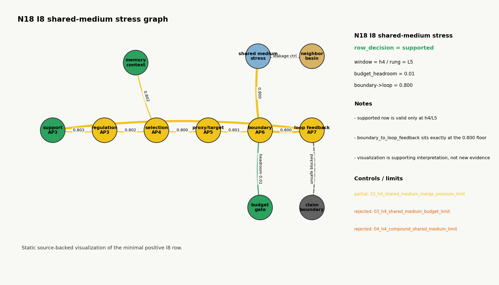
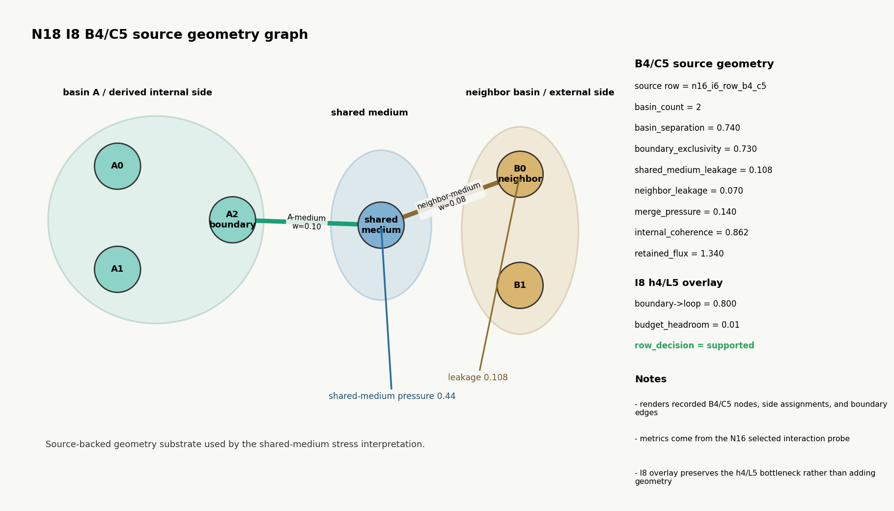
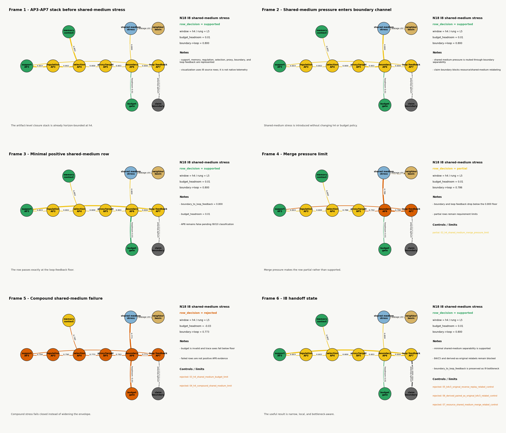

# Experiments

This directory contains historical evidence lanes for graph-native and LGRC
Reflexive Coherence work. These lanes are not product demos. They are bounded
research records with explicit claim ceilings, controls, reports, and artifacts.

## Reconstruction Pattern

Use this sequence when inspecting or rerunning a lane:

1. Read the lane `README.md` for its question, claim boundary, and non-claims.
2. Read `implementation/` for the staged plan, checklist, and closeout notes.
3. Inspect `configs/` and `hypotheses/` when present to understand fixtures and
   expected controls.
4. Run or inspect `scripts/` for the reconstruction path.
5. Compare regenerated or committed `outputs/` against `reports/`.
6. Treat `claim_ceiling`, blocked flags, and control results as part of the
   evidence, not as side commentary.

Experiment-local `outputs/` may be committed as historical evidence when they
are selected for public inspection. They must use relative paths and avoid
machine-local state.

## Lane Index

| Lane | Focus | Reconstruction entry |
| --- | --- | --- |
| [N01 GRC9V3 properties](2026-05-N01-grc9v3-properties/README.md) | Port, row, column, routing, refinement, and identity behavior in `GRC9V3`. | README, then `implementation/`, `hypotheses/`, `scripts/`, `reports/`, `outputs/`. |
| [N02 GRC9V3 metric mesh](2026-05-N02-grc9v3-metric-mesh/README.md) | `GRC9V3` as graph-native metric support for field patterns and observer-backed motion. | README, then configs/hypotheses and script/report pairs. |
| [N03 polarized basin loops](2026-05-N03-grc9v3-polarized-basin-loops/README.md) | Conserved source/sink-aspect loops, packetized causal mechanisms, and execution-surface boundaries. | README, then `scripts/`, raw records under `outputs/`, and reports. |
| [N04 movement ladders](2026-05-N04-grc9v3-movement-ladders/README.md) | Movement taxonomy, boundary coupling, support shifts, and bounded movement claim ceilings. | README, then implementation checklist, validator outputs, and reports. |
| [N05 coherence waves and oscillators](2026-05-N05-lgrc-coherence-waves-oscillators/README.md) | LGRC delayed pulses, reflected/amplified returns, repeated cycles, and oscillator candidates. | README, then `scripts/run_n05_iteration_*.py`, `outputs/`, and `reports/`. |
| [N06 semantic route choice](2026-05-N06-lgrc-semantic-route-choice/README.md) | Runtime-visible route alternatives, native arbitration, context-conditioned selection, and controls. | README, then fixture manifest, iteration scripts, outputs, and reports. |
| [N07 RC identity attractor invariance](2026-05-N07-rc-identity-attractor-invariance/README.md) | Identity/support evidence, bounded non-destructive exchange, and withdrawal/restoration baselines. | README, then iteration scripts, output artifacts, and closeout reports. |
| [N08 memory trail affordance](2026-05-N08-lgrc-memory-trail-affordance/README.md) | Route-use memory, trail/affordance surfaces, producer-policy memory, and geometry-mediated alternatives. | README, then scripts, outputs, reports, and hypothesis notes. |
| [N09 goal-proxy regulation](2026-05-N09-lgrc-goal-proxy-regulation/README.md) | Runtime-visible proxy measurement, bounded correction, support dependence, and native-substrate blockers. | README, then iteration scripts, output artifacts, and reports. |
| [N10 agentic-like integration](2026-05-N10-lgrc-agentic-like-integration/README.md) | Bounded composition of route choice, memory-shaped affordance, identity/support baseline, and proxy regulation. | README, then hypothesis closeouts in `outputs/` and matching reports. |
| [N11 general agentic-like integration](2026-05-N11-lgrc-general-agentic-like-integration/README.md) | Transfer across context, support state, proxy condition, and horizon while preserving claim boundaries. | README, then final closeout script/output and reports. |
| [N12 native naturalization and producer dissolution](2026-06-N12-lgrc-native-naturalization-and-producer-dissolution/README.md) | Bridge experiment classifying N05-N11 producer mechanisms into native absorption candidates, scaffolds, and theory-sensitive blockers. | README, then implementation plan/checklist, naturalization artifacts, Phase 8 readiness matrix, and closeout handoff. |
| [N13 self-maintenance and support-seeking regulation](2026-06-N13-lgrc-self-maintenance-and-support-seeking-regulation/README.md) | Artifact-level AP3 support-seeking regulation candidate derived from source-current support state, with controls and claim boundaries. | README, then implementation plan/checklist, support schema, control/stress artifacts, and closeout handoff. |
| [N14 consequence-sensitive route selection](2026-06-N14-lgrc-consequence-sensitive-route-selection/README.md) | Closed artifact-level AP4 consequence-sensitive route selection with observed route-specific memory and constructed support/regulation followout. | README, then closeout handoff, claim boundary, consequence records, controls, and replay artifacts. |
| [N15 endogenous proxy formation](2026-06-N15-lgrc-endogenous-proxy-formation/README.md) | Closed artifact-level AP5 endogenous target/proxy formation from source-current support, memory, regulation, and AP4 consequence context. | README, then closeout handoff, claim boundary, control matrix, bounded-drift replay, and validator artifacts. |
| [N16 self/environment boundary](2026-06-N16-lgrc-self-environment-boundary/README.md) | Closed artifact-level AP6 self/environment boundary candidate with controlled basin-boundary requirements and claim-clean N17 handoff. | README, then closeout handoff, claim boundary, requirements matrix, selected probes, and source inventory. |
| [N17 closed boundary engagement loop](2026-06-N17-lgrc-closed-boundary-engagement-loop/README.md) | Closed artifact-level AP7 closed boundary engagement loop candidate across perturbation, resource/support, and local shared-medium families. | README, then closeout handoff, comparative requirements matrix, claim boundary, loop controls, and extension artifacts. |
| [N18 long-horizon agentic-like closure stress test](2026-06-N18-lgrc-long-horizon-agentic-like-closure-stress-test/README.md) | Closed limited artifact-level AP8 long-horizon agentic-like closure candidate over the narrow h4/L5 stress envelope, with general AP8, Phase 8, native support, agency, and identity claims blocked. | README, then closeout handoff, I9 classification matrix, stress artifacts, hypotheses, and implementation checklist. |
| [N19 native naturalization review AP3-AP8](2026-06-N19-lgrc-native-naturalization-review-ap3-ap8/README.md) | Closed N12-style native naturalization and Phase 8 readiness review for the N13-N18 AP3-AP8 stack; records 12 NAT4 surfaces while blocking full native ladder generation on AP4/AP5 NAT4 gaps. | README, then closeout handoff, candidate matrix, Phase 8 readiness matrix, implementation checklist, and hypotheses. |
| [N20 becoming-primitive producer translation contract](2026-06-N20-lgrc-becoming-primitive-producer-translation-contract/README.md) | Closed contract experiment defining LGRC-visible becoming primitives, producer residue, naturalization debt, continuation-function descriptors, proxy blockers, same-basin controls, and the N21 handoff without claiming primitive evidence. | README, then closeout handoff, same-basin contract, producer residue ledger, function/proxy contract, implementation checklist, and hypotheses. |
| [N21 withdrawal resistance and naturalization depth](2026-06-N21-lgrc-withdrawal-resistance-and-naturalization-depth/README.md) | Closed bounded becoming-primitive evidence experiment: WR6 artifact-level withdrawal-resistance candidate plus bounded N21-local ND5 naturalization-depth candidate, with agency, native support, sentience, Phase 8, ant ecology, robust withdrawal, support-removal resistance, and general naturalization depth blocked. | README, then closeout handoff, replay/control matrix, withdrawal and naturalization probes, implementation checklist, and hypotheses. |
| [N22 susceptibility update and durable geometry modification](2026-06-N22-lgrc-susceptibility-update-durable-geometry-modification/README.md) | Closed bounded artifact-level susceptibility-update candidate: producer-mediated SU5 durable geometry modification evidence with N22-C6/N23 handoff, while native route-conductance memory, semantic learning, choice, agency, native support, sentience, Phase 8, ant ecology, and SU6 remain blocked. | README, then closeout handoff, replay/control matrix, carrier and packet probes, implementation checklist, and hypotheses. |

## Current Roadmap State

N05-N11 closed as an artifact-level foundation for agentic-like LGRC
composition:

```text
N11 final_supported_gali_ceiling = GALI7
N11 final_claim_ceiling = broader_general_artifact_only_agentic_like_integration_candidate
artifact_only = true
fully_native = false
```

N12 closed as a bridge experiment, not a native implementation. It identified
`native_route_conductance_memory_policy` and `native_response_magnitude_policy`
as Phase 8-ready native policy candidates while keeping identity acceptance and
full native agentic-like integration blocked.

N13 closed at:

```text
final_supported_ap_level = AP3
final_claim_ceiling = artifact_level_ap3_self_maintenance_candidate_support_seeking_regulation
artifact_only = true
fully_native = false
phase8_opened = false
native_support_opened = false
agency_claim_opened = false
identity_acceptance_opened = false
semantic_goal_ownership_opened = false
```

N13 supports only artifact-level self-maintenance candidate /
support-seeking regulation evidence. It does not support agency, intention,
semantic goal ownership, identity acceptance, selfhood, personhood, biological
behavior, native support, or fully native agentic-like integration.

N14 closed as a claim-clean artifact-level `AP4` experiment:

```text
final_supported_ap_level = AP4
final_claim_ceiling = artifact_level_ap4_consequence_sensitive_route_selection_candidate_with_constructed_route_conditioned_support_regulation_followout
artifact_only = true
fully_native = false
phase8_opened = false
native_support_opened = false
```

N14 supports consequence-sensitive route selection from source-backed
downstream consequence records. Its final scope is observed route-specific
memory plus constructed route-conditioned support/regulation followout.
Upstream observed N09/N13 route-conditioned support/regulation remains
unsupported. The result is not intention, agency, semantic goal ownership,
identity acceptance, native support, or fully native integration.

N15 closed as a claim-clean artifact-level `AP5` experiment:

```text
final_supported_ap_level = AP5
final_claim_ceiling = artifact_level_ap5_endogenous_proxy_formation_candidate
artifact_only = true
fully_native = false
phase8_opened = false
native_support_opened = false
```

N16 closes with artifact-level AP6 self/environment boundary evidence:
internal support-relevant state and external resource, perturbation,
structured-state, and shared-medium pressures remain separable in generated
artifacts and controls. The result is not selfhood, identity acceptance,
semantic goal ownership, agency, native support, fully native integration,
organism/life, unrestricted agency, or a closed action-perception loop. That
handoff is now consumed by N17; targeted Phase 8 remained optional and
deferred, not required before N17.

N17 closes with artifact-level AP7 closed boundary engagement loop evidence:
the perturbation-response-recovery MVP reaches bounded G5, resource/support
modulation reaches local G5, and shared-medium evidence reaches local G6 while
one-way crossing, semantic action/perception, agency, selfhood, identity
acceptance, native support, organism/life, fully native integration, and
unrestricted agency remain blocked. N18 has now consumed that handoff and
closed the long-horizon stress lane; targeted Phase 8 remains optional and
deferred.

N18 closes as `AP8_limited_artifact_candidate`: a limited artifact-level AP8
long-horizon agentic-like closure candidate over the narrow h4/L5 stress
envelope. The closeout preserves `max_supported_horizon = h4`,
`horizon_extrapolation_allowed = false`, `principal_bottleneck_link =
boundary_to_loop_feedback`, and Phase 8/native support remain unopened.
General AP8, semantic agency, identity acceptance, organism/life, fully native
integration, and unrestricted agency claims remain blocked.

N18 Iteration 8 supporting visualization:

| Stress-relation graph | B4/C5 source geometry | Source-row sequence |
| --- | --- | --- |
| [](2026-06-N18-lgrc-long-horizon-agentic-like-closure-stress-test/outputs/n18_iteration8_shared_medium_visualization/n18_i8_shared_medium_animation.gif) | [](2026-06-N18-lgrc-long-horizon-agentic-like-closure-stress-test/outputs/n18_iteration8_shared_medium_visualization/n18_i8_b4c5_source_geometry_animation.gif) |  |

Click either graph image to open its animation. The stress graph shows how the
I8 evidence axes relate to each other; the geometry graph shows the
source-backed B4/C5 artifact geometry constructed from basin nodes, side
assignments, and boundary edges. The visuals are supporting artifact-level
inspection aids, not native LGRC telemetry or additional evidence.

N19 closes as the N12-style native naturalization review for the N13-N18
AP3-AP8 stack:

```text
final_claim_ceiling = artifact_level_phase8_readiness_review_for_ap3_ap8
phase8_ready_surface_count = 12
full_ap3_ap8_nat4_ladder_generation_supported = false
current_implementation_can_generate_claimed_ap_ladder = false
claimed_ladder_generation_status = blocked_by_ap4_ap5_nat4_evidence_gaps
phase8_opened = false
native_support_opened = false
ap9_opened = false
```

N19 records local NAT4 Phase-8-ready surfaces for AP3, AP6, AP7, and limited
AP8, but AP4/N14 and AP5/N15 remain below NAT4. Therefore the current
implementation cannot generate the claimed AP3-AP8 ladder as a complete NAT4
ladder. This closes the current N12-N19 documentation/review stack.

N20 closes as the first N20-N29 contract experiment:

```text
final_supported_status = N20_contract_closed_no_primitive_evidence
final_claim_ceiling = artifact_level_becoming_primitive_translation_contract_only
primitive_evidence_opened = false
agency_claim_opened = false
phase8_opened = false
native_support_opened = false
sentience_opened = false
ant_ecology_spec_opened = false
ready_for_n21 = true
n21_handoff_scope = withdrawal_resistance, naturalization_depth
```

N20 supports contract closure only: translation schema, producer residue,
naturalization debt, continuation-function descriptors, proxy blockers,
same-basin criteria, and fail-closed N21 handoff gates. It does not support
withdrawal resistance, naturalization depth, learning, choice, abundance,
spark/new-basin formation, proxy collapse, transfer, generative persistence,
agency, Phase 8, native support, sentience, organism/life, or ant-ecology
implementation.

N21 closes as the first becoming-primitive evidence experiment:

```text
final_supported_status = bounded_artifact_level_withdrawal_and_naturalization_candidate
withdrawal_resistance_status = withdrawal_resistance_supported_artifact_level_candidate
withdrawal_resistance_ladder_rung = WR6
naturalization_depth_status = naturalization_depth_supported_bounded_N21_candidate
naturalization_depth_ladder_rung = ND5
n21_closeout_ladder_rung = N21-C6
ready_for_n22 = true
```

N21 supports bounded artifact-level withdrawal-resistance evidence and bounded
N21-local naturalization-depth evidence. The withdrawal side is scoped to
declared support weakening, transfer/schedule-shape rows, and explicit
floor/removal fail-closed boundaries; it does not support robust withdrawal
resistance or support-removal resistance. The naturalization side is scoped to
initial no-probe replay, static post-probe-derived persistence, and eventful
post-probe-derived persistence; it does not support general naturalization
depth or `ND6`.

N22 closes as the bounded susceptibility-update / durable geometry modification
experiment:

```text
final_supported_status = bounded_artifact_level_susceptibility_update_candidate
final_supported_su_ladder_rung = SU5_producer_mediated_bounded_susceptibility_update_candidate
n22_closeout_ladder_rung = N22-C6
n22_closeout_supported = true
source_backed_susceptibility_update_evidence = true
delta_survived_replay_and_later_reentry = true
same_budget_peer_comparison_rules_out_global_drift = true
su6_supported = false
native_route_conductance_memory_supported = false
semantic_learning_supported = false
semantic_choice_supported = false
agency_supported = false
native_support_supported = false
phase8_opened = false
ant_ecology_opened = false
ready_for_n23 = true
```

N22's packet branch remains capped at `SU3` because repeated readout spends the
packet residue. Its successful carrier branch reaches controlled
producer-mediated `SU5`: I5-C creates a non-consumptive carrier in
LGRC-visible edge conductance state, I6-A shows transfer/re-entry, I6-B shows
bounded stress survival, and I7 replay/control validation remains clean. The
carrier write policy is still producer-mediated, so native route-conductance
memory and native non-consumptive carrier update policy remain naturalization
debt.

N22 preserves the N19 AP4/AP5 NAT4 gap claims. AP4 is propagated for
route-conditioned susceptibility/transfer; AP5 remains preserved for later
proxy/target-dependent rows. N22 does not resolve those gaps.

The N21 `ND6` bridge is recorded only as a bounded producer-mediated bridge
candidate. N21 remains closed and is not retroactively upgraded.

The N20-N29 arc keeps three paths distinct until N29:

```text
geometric coherence papers and essays:
    Arc of Becoming method plus agency-specific interpretation from the essays

graph substrate experiments:
    N01-N28 LGRC primitive evidence and control discipline

agentic ecology / ants project:
    applied multi-basin shared-medium ecology target, held as context until N29
```

N20-N28 stay inside this repository and ground becoming-style primitives:
withdrawal resistance, naturalization depth, susceptibility update, live
continuation collapse, surplus-supported optionality, spark/new-basin
formation, proxy divergence, transfer, and generative persistence. N21 closed
the first two primitives, N22 closed bounded producer-mediated susceptibility
update / durable geometry modification, and N23 is now the next
live-continuation collapse / selection geometry lane. N29 is the first formal
convergence bridge into the agentic ecology project, where
producer residue, medium debt, and first applied ant-ecology probes can be
specified. Phase 8, native support,
native ant agency, biological agency, and unrestricted agency remain unopened.
The agency-specific essay sources include `From Structural Abundance to
Agency`, `Agency of Becoming`, `Agency After Choice`, and `Sentience as
Read-Back`; the last is a boundary source for separating agency from sentience,
not a sentience claim.

Roadmap-level context:

- [N05-N11 LGRC Agentic-Like Foundation Roadmap](N05-N11-LGRC-AgenticLikeFoundationRoadmap.md)
- [N12-N18 LGRC Agency Prerequisites Roadmap](N12-N18-LGRC-AgencyPrerequisitesRoadmap.md)
- [N20-N29 LGRC Becoming-Agency Ecology Roadmap](N20-N29-LGRC-BecomingAgencyEcologyRoadmap.md)
- [N20-N29 LGRC Becoming-Agency Ecology Handoff](N20-N29-LGRC-BecomingAgencyEcologyHandoff.md)
