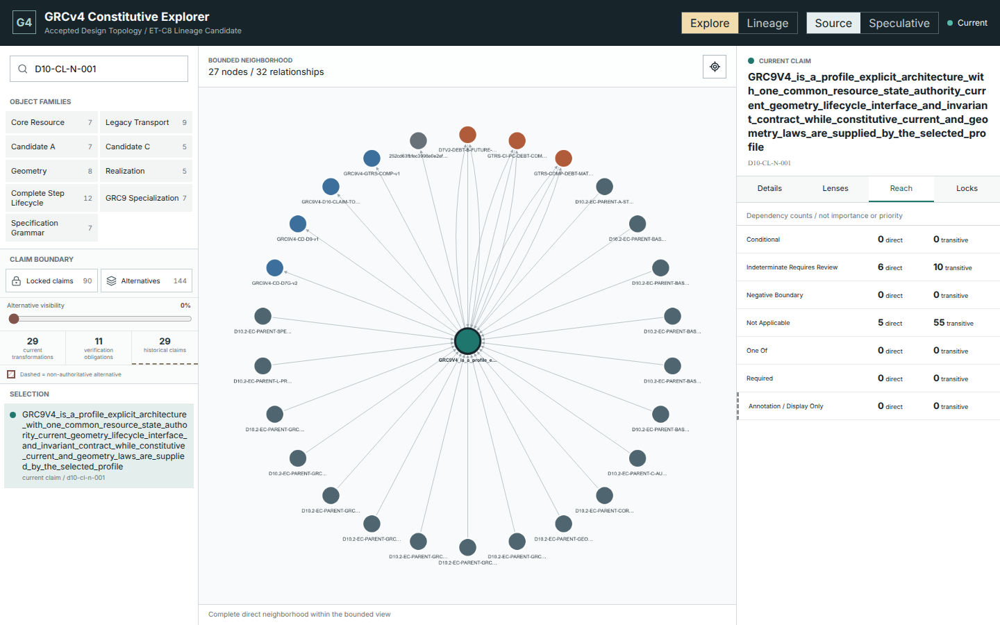
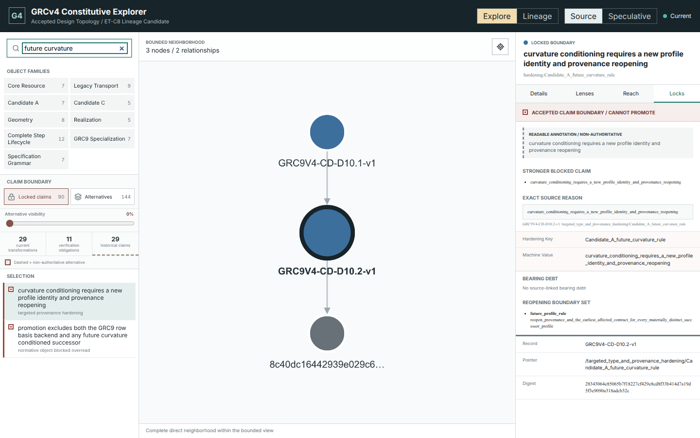
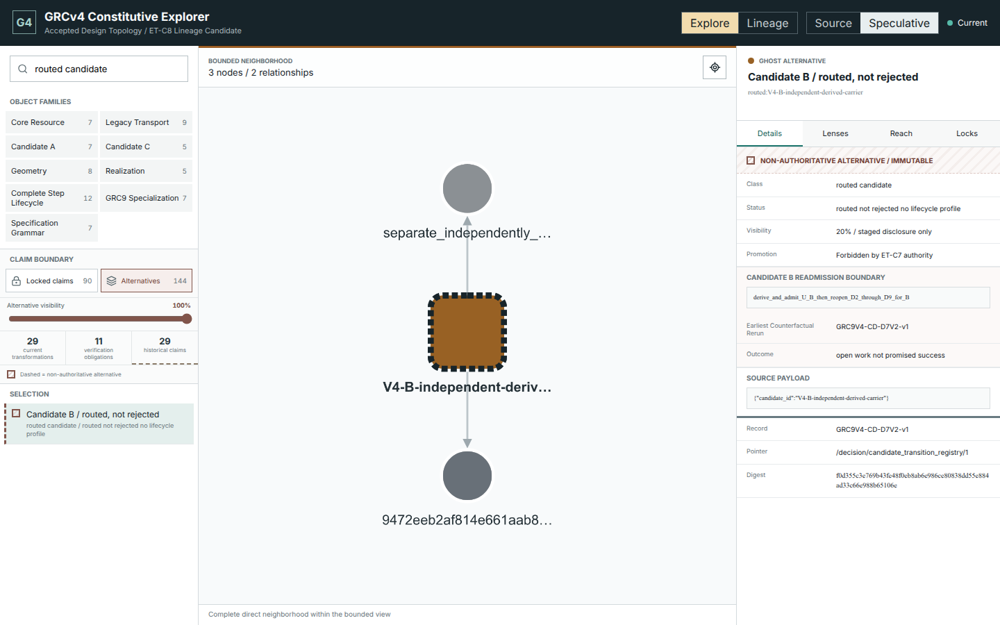
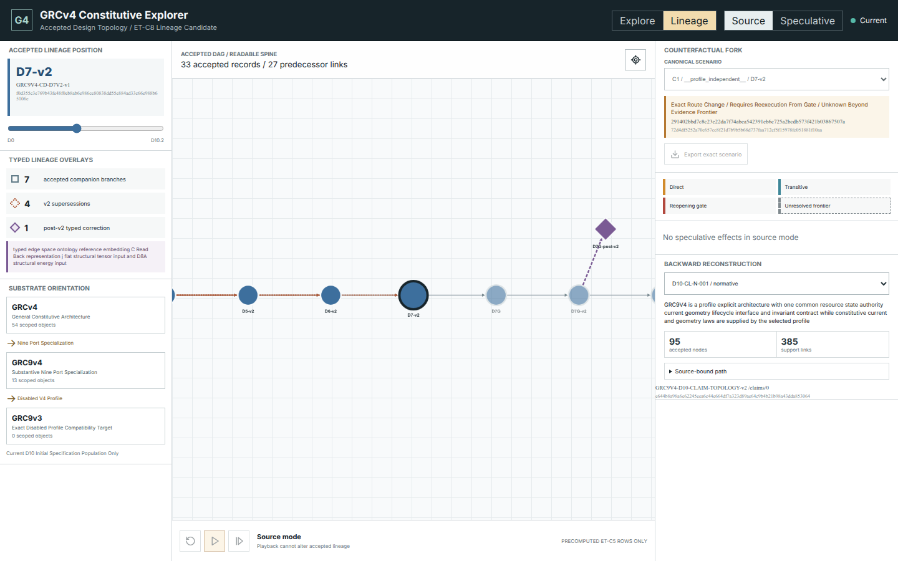
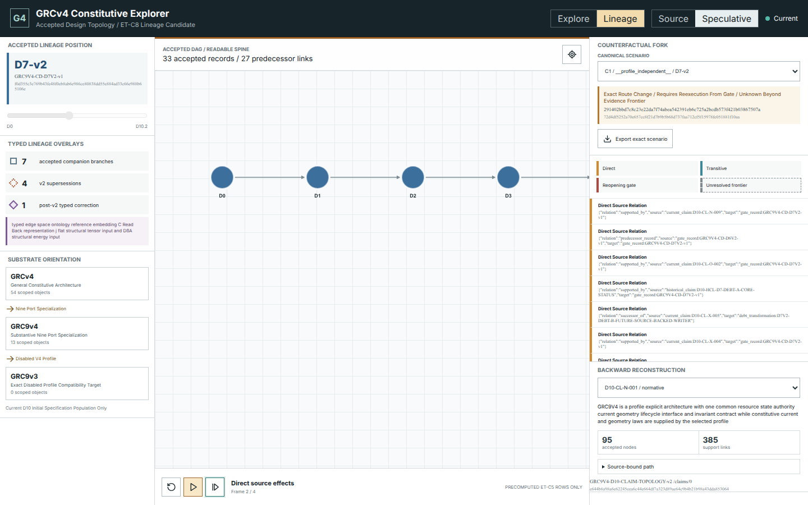
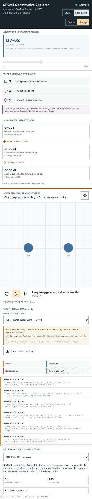

# User Guide

The GRCv4 Constitutive Explorer is a read-only view over the accepted
constitutive-design investigation. It helps you find claims, inspect their
sources, compare candidate histories, and play already compiled structural
counterfactuals. It does not run GRCv4, prove new results, or predict what a
reopened gate would decide.

The tool sits between theory, substrate design, and code. It makes the accepted
claim topology and its provenance inspectable so an implementer can see what a
runtime or specification may responsibly consume. It does not simulate the
theory, select an architecture, or turn a precomputed fork into an implementation
decision.

## Short Glossary

| Term | Meaning in this tool |
| --- | --- |
| **spine** | The readable 26-position path through accepted gates; it is an orientation path, not the complete lineage DAG. |
| **companion branch** | An accepted lineage branch shown beside the spine, such as a v2 successor, correction, realization, or provenance branch. |
| **bearing debt** | A source-linked unresolved obligation that bears on whether a stronger claim can be made. |
| **claim ceiling** | The strongest claim currently supported by the admitted evidence and authority boundary. |
| **provenance hardening** | A source-owned rule that prevents an equation, role, or lineage from being promoted beyond its demonstrated origin. |
| **resolved negative** | An accepted negative boundary: evidence supports that a stronger relabel or construction is not available under the tested conditions. |

## Start The Explorer

From the repository root:

```bash
TOOL=implementation/investigations/grc9v4-constitutive-design/tools/exploratory-side-tool/tool
python3 "$TOOL/scripts/bootstrap.py"
.venv/bin/python "$TOOL/scripts/run.py" serve-iteration8
```

Open `http://127.0.0.1:4173`. Stop the server with `Ctrl+C`.

`serve-iteration8` names the static browser build: the latest accepted browser
surface is ET-C8. `verify-iteration9` runs the larger closeout cascade over that
ET-C8 surface, all prior accepted kernels, the guides, and the accepted ET-C9 closeout;
it does not rename the browser build to ET-C9. To inspect whether accepted
source has changed since that build, run:

```bash
.venv/bin/python "$TOOL/scripts/run.py" discover-sources
```

`Current` means the admitted bundle still reconstructs exactly. It does not
mean the constitutive investigation can never change. New material is shown as
unprocessed and cannot enter the explorer until a successor processing cycle
is accepted.

## Complete Workflow Index

| Use case | Start | Example endpoint |
| --- | --- | --- |
| Verify the working source | terminal | `source_observation_state=current_bundle_exact` |
| Run the forensic notebook | terminal then Explore / Source | two canonical traces cross-checked in the browser |
| Survey one object family | Explore / Source | bounded family catalog and graph |
| Reconstruct an accepted claim | Explore then Lineage / Source | source-bound support path for `D10-CL-N-001` |
| Separate debt history from forward work | Explore / Source | debt lenses with verification obligations kept separate |
| Inspect what a gate did | Explore and Lineage / Source | gate act, predecessor, contribution, and authority boundary |
| Trace a candidate without ranking it | Explore / Source or Speculative | accepted, routed, conditional, and historical states |
| Find contracts below a parent object | Explore / Source | parent object, direct contracts, and bounded dependents |
| Read dependency reach correctly | Explore / Source | direct/transitive rows by support semantic |
| Understand a blocked claim | Explore / Source / Locks | exact lock reason and reopening boundary |
| Inspect pruned alternatives | Explore / Speculative / Alternatives | non-promotable ghost layer |
| Scrub accepted gate history | Lineage / Source | readable spine plus companion branches |
| Play a structural fork | Lineage / Speculative | reopening gate and unresolved frontier |
| Export an exact scenario | Lineage / Speculative | canonical scenario JSON, unchanged by the browser |

The workflows below give a complete start state, action path, expected endpoint,
and interpretation boundary for each use case.

The canonical definitions and ownership of all 35 governed F/N/C/D/E scenarios
remain in the
[user-scenario contract](../GRCV4ExploratorySideToolUserScenarios.md). This
guide groups them into practical browser workflows rather than duplicating the
scenario catalog.

## Use Case 1: Survey One Object Family

The first workspace is organized around one selected graph object.



1. Select **Explore** in the header.
2. Keep **Source** selected when you want accepted-state reconstruction only.
3. Choose a family to narrow the catalog.
4. Search by claim, debt, gate, candidate, object, contract, or record ID.
5. Select a result to load its bounded neighborhood.
6. Use the detail tabs to inspect the object, supported lenses, and dependency
   reach.

For a concrete pass, select the `candidate_A` family and search for
`A-DIRECTIONAL-CONTRAST`. The selected object should show its source record and
JSON pointer, a graph containing the selected node, and only the lenses admitted
for an object/contract surface.

**Expected endpoint:** a bounded object neighborhood with source details and no
full-graph expansion.

**Interpretation boundary:** family count is coverage. It is not candidate
ranking or profile propagation.

The graph deliberately shows a bounded neighborhood rather than all 436 nodes.
Dependency reach describes structural reach, not importance, confidence,
severity, or rank.

## Use Case 2: Reconstruct An Accepted Claim

Complete path:

1. Select **Explore** and **Source**.
2. Search for `D10-CL-N-001` and open the exact result.
3. Confirm the selected ID, source record, JSON pointer, and current
   classification in the detail panel.
4. Open **Lenses** and inspect support and bearing-debt rows. Do not expect debt
   or forward-work lenses that are not valid for a claim.
5. Open **Reach** and compare direct with transitive rows by support semantic.
6. Select **Lineage**.
7. In **Backward reconstruction**, select `D10-CL-N-001 / normative`.
8. Expand **Source-bound path** and retain the displayed reconstruction digest.

The endpoint includes:

- its source record and JSON pointer;
- the support or bearing-debt lenses that exist for that node family;
- direct and transitive reach separated by support semantic; and
- the backward reconstruction in **Lineage**.

Unsupported lenses are omitted. Their absence is not an empty result and must
not be filled by analogy.

**Expected endpoint:** the reconstruction reports accepted nodes and support
links, with an expandable source-bound path and exact digest.

**Interpretation boundary:** forward verification obligations are excluded;
support-link count is not confidence or rank.

## Use Case 3: Separate Debt History From Forward Work

1. Select **Explore** and **Source**.
2. Search for `GTRS-COMP-DEBT-MATCHED-RUNTIME-DISCRIMINATION`.
3. Select the debt-transformation result, not a similarly named claim or
   source record.
4. Open the debt-specific lenses.
5. Read the historical blocked claim, transformation, successor claim, and
   closing/routing gate.
6. Read any verification obligation in its separate forward-work lens.
7. Follow the source record and JSON pointer when quoting the transformation.

**Expected endpoint:** the debt transformation and any forward verification
work are visible as distinct rows.

**Interpretation boundary:** a verification obligation is future work, not
evidence that closes the debt. A routed debt is not the same as a resolved debt.

## Use Case 4: Inspect A Gate Act And Contribution

1. Select **Explore** and **Source**.
2. Search for `GRC9V4-CD-D7V2-v1`.
3. Select the gate record and read its accepted act, decision scope, claim
   ceiling, and predecessor identity.
4. Inspect its triangulation rows to distinguish added, inherited, superseded,
   and routed content.
5. Select **Lineage** and move the scrubber to `D7-v2`.
6. Confirm the same gate's position relative to its predecessor and companion
   branches.

**Expected endpoint:** gate authority and gate contribution are both visible
without reducing them to one status.

**Interpretation boundary:** inherited content was not newly proved by this
gate; routed content was not accepted as part of the gate's completed result.

## Use Case 5: Find Contracts Below A Parent Object

1. Select **Explore**, **Source**, and the relevant family.
2. Search for `CORE-C-AUTHORITY` and select the normative-object result.
3. Open **Lenses** to see direct equation-contract children.
4. Open **Reach** to inspect bounded dependents.
5. Search for `D10.2-EC-PARENT-CORE-C-AUTHORITY` and select the equation
   contract.
6. Compare its source, admitted scope, parent-object relation, and accepted
   support semantics with the parent object.

**Expected endpoint:** one parent-object view and one contract-provenance view,
linked but not collapsed.

**Interpretation boundary:** the parent object and equation contract are
different layers. An indeterminate support semantic remains indeterminate.

## Use Case 6: Read Dependency Reach Without Ranking

1. Select an object, contract, claim, debt, or gate in **Explore**.
2. Open **Reach**.
3. Read each support semantic separately: required, one-of, conditional,
   negative-boundary, indeterminate, or not-applicable.
4. Compare direct nodes with transitive nodes.
5. Return to **Lenses** before assigning meaning to a particular relation.

**Expected endpoint:** direct and transitive dependency populations, partitioned
by source semantics.

**Interpretation boundary:** reach is structural. Larger reach does not imply
greater scientific importance, confidence, priority, or causal strength.

## Use Case 7: Understand A Claim Lock

The lock view shows accepted negative claims and blocked overreads with their
source-owned reason.



1. Stay in **Source** mode.
2. Open the claim-ceiling or **Locks** view.
3. Select a locked row.
4. Read the stronger blocked claim, exact machine reason, source record, and
   earliest reopening boundary.

Use `future curvature` as the concrete search. The selected lock should report
`accepted-source-lock` and retain the D10.2 hardening source rather than a
generic `needs evidence` explanation.

**Expected endpoint:** a source-exact machine lock reason and named reopening
boundary.

A lock is not a hidden low score. It is a specific claim boundary. The readable
description is an annotation; the source machine value remains authoritative.

## Use Case 8: Trace A Candidate And Its Alternatives

Switch to **Speculative**, then open **Alternatives**.



The visibility slider progressively reveals rejected candidates, routed or
conditional alternatives, blocked relabels, and historical claims. It changes
visibility and opacity only. A ghost cannot become accepted through selection,
dragging, filtering, or playback.

Complete path:

1. Select **Explore** and the relevant candidate family.
2. In **Source** mode, search for `V4-B-independent-derived-carrier` and read
   its current routed/closed-tranche state.
3. Switch to **Speculative**.
4. Open **Alternatives**.
5. Move the visibility slider from 0 toward 100.
6. Search `routed candidate` and select the matching alternative.
7. Confirm the surface reports `promotion_allowed = false`.
8. Return the slider to 0 and switch back to **Source**; accepted state must be
   unchanged.

**Expected endpoint:** Candidate B's accepted route remains distinct from
ghosted historical and conditional alternatives.

Important distinctions remain visible:

- routed is not rejected;
- historical is not current authority;
- conditional is not normative;
- a blocked relabel is not a candidate result; and
- V4-D is an uninstantiated admission slot, not a fourth complete architecture.

## Use Case 9: Scrub Accepted Gate Lineage

Select **Lineage** to inspect how the accepted gate DAG developed.



Use the left scrubber to move through the readable accepted spine. Companion
branches, v2 supersessions, and the post-v2 correction remain separately
marked; the view does not flatten the investigation into a false linear
timeline.

Complete path:

1. Select **Lineage** and **Source**.
2. Drag the **Accepted lineage position** scrubber from D0 toward D10.2.
3. Stop at D7-v2 and inspect the highlighted graph node.
4. Compare the 26-position readable spine with the seven companion branches.
5. Inspect the typed overlay counts for v2 supersessions and post-v2
   correction.
6. Read **Substrate orientation** before interpreting GRCv4, GRC9v4, and GRC9v3
   rows.

**Expected endpoint:** one accepted gate is selected while non-spine branches
remain visible and typed.

The substrate orientation reads:

```text
GRCv4
  -> nine-port specialization GRC9v4
  -> disabled V4 profile GRC9v3
```

This is an accepted orientation boundary, not a claim that every GRCv4 runtime
must share one implementation with GRC9v4.

## Use Case 10: Play A Precomputed Structural Fork

In **Lineage**, switch to **Speculative** and choose a canonical scenario.



The playback controls move through four compiled frames:

1. accepted baseline;
2. mutation at the selected historical point;
3. direct and transitive known effects; and
4. reopening gate plus unresolved evidence frontier.

Solid nodes remain accepted and unaffected. Reopening roots and unresolved
descendants are visibly distinct. The browser does not calculate propagation;
it renders ET-C5 rows compiled by Python. Beyond the frontier, the correct
reading is **unknown until re-execution**, not a predicted failure or success.

Use **Export exact scenario** to retain the canonical scenario identity. The
export does not authorize editing or a new mutation.

Concrete path:

1. Select **Lineage** and **Speculative**.
2. Choose the scenario containing `ET-C5-C1` and `D7-v2`.
3. Read the scenario classification and digest before playback.
4. Press **Step** three times to reach frame 4 of 4.
5. Confirm one reopening-gate effect and at least one unresolved-frontier row.
6. Compare direct with transitive effect styling.
7. Select **Export exact scenario** and retain the exported scenario digest.
8. Return to **Source** and confirm the panel says no speculative effects are
   present.

**Expected endpoint:** the final frame is labeled **Reopening gate and evidence
frontier**; no post-frontier outcome is shown.

## Use Case 11: Reconstruct A Claim While Viewing A Fork

The right-side **Backward reconstruction** selector traces a visible claim to
accepted support:

- accepted nodes and support-link counts;
- a source-bound path;
- source record and JSON pointer; and
- a reconstruction digest.

Forward verification obligations are excluded from backward evidence. A large
support count does not rank the claim above another claim.

This panel remains source-bound even while speculative playback is visible.
Use it to compare what is currently accepted with what the selected mutation
would force to be rerun. Do not treat the reconstruction as support for the
speculative branch.

## Use Case 12: Detect Source Evolution Before Browsing

1. Stop the browser server if it is running.
2. Run `.venv/bin/python "$TOOL/scripts/run.py" discover-sources`.
3. Read `source_observation_state` and preserve the observation digest.
4. For `current_bundle_exact`, start the browser and use the current accepted
   snapshot.
5. For `new_unprocessed_source_available`, inspect the reported paths but do
   not expect them in search.
6. For changed, missing, or unreadable admitted source, stop and resolve the
   source/readmission boundary before relying on the explorer.

**Expected endpoint:** either an exact-current observation or an explicit
fail-closed state. Discovery never silently updates the graph.

## Use Case 13: Run The Forensic Notebook And Cross-Check The Browser

The current accepted notebook surface is one tracked orchestration notebook,
[forensic_recipes.ipynb](../tool/notebooks/forensic_recipes.ipynb). It contains
two recipes and calls the same pure forensic API used elsewhere; it does not
duplicate source parsing, graph construction, or scientific logic.

Run it from the repository root:

```bash
.venv/bin/python "$TOOL/scripts/run.py" discover-sources
.venv/bin/python "$TOOL/scripts/run.py" notebook-iteration3
```

The supported runner executes the notebook deterministically without a Jupyter
dependency and prints:

```text
ET_C3_NOTEBOOK_PASS recipes=2 output=tool/generated/iteration3-notebook
```

It writes only these ignored derived traces:

```text
tool/generated/iteration3-notebook/normative-claim.json
tool/generated/iteration3-notebook/candidate-B.json
```

Complete the workflow:

1. Inspect `normative-claim.json`; confirm it is a
   `forensic_evidence_trace` for `D10-CL-N-001` with source and edge witnesses.
2. Inspect `candidate-B.json`; preserve Candidate B's routed-not-rejected and
   missing-constitutive-derivation classifications.
3. Start `serve-iteration8`.
4. In **Explore / Source**, search `D10-CL-N-001` and compare its source-bound
   reconstruction with the first trace.
5. Search `V4-B-independent-derived-carrier` and compare its career with the
   second trace.
6. Treat the JSON traces as derived query output. Do not move them into
   `records/` or use them as new scientific evidence.

**Expected endpoint:** two canonical notebook traces agree with the browser's
accepted source presentation while remaining inside `tool/generated/`.

**Interpretation boundary:** the notebook is an orchestration surface, not an
independent evidence engine. The tracked `.ipynb` expects `repo_root`,
`side_tool_root`, and `output_dir` from the accepted runner, so opening it
directly in an arbitrary Jupyter session is not the supported path. Jupyter is
not a current dependency, and global Jupyter/Python must not be used. There is
not yet a second tracked counterfactual-authoring notebook: counterfactual
authoring is currently exposed through the governed Python API, while ET-C5
tests the exact notebook/Python-to-browser scenario serialization contract.


## Mobile Layout

The same controls stack into a single reading order on narrow screens.



The graph keeps stable dimensions and can extend horizontally inside its own
surface. Continue down the page for fork effects and backward reconstruction;
long IDs wrap rather than overlap controls.

## Source And Speculative Modes

Use the segmented control in the header as the main interpretation boundary.

| Mode | Meaning |
| --- | --- |
| **Source** | Accepted source reconstruction only; no speculative effects are displayed. |
| **Speculative** | Precomputed structural alternatives or forks are visible, with accepted and unresolved state kept distinct. |

Changing mode does not modify accepted source. Returning to **Source** restores
the source-only presentation.

## What The Explorer Cannot Do

The explorer cannot:

- produce new GRCv4 or GRC9v4 scientific evidence;
- run a constitutive or graph runtime;
- determine numerical stability or parameter effects;
- predict a reopened gate;
- promote an alternative, historical claim, or ghost node;
- admit newly added source automatically; or
- establish specification or runtime conformance.

Use it to locate and understand current evidence, not to replace the underlying
records or the next investigation gate.

## Troubleshooting

### The server does not start

Run bootstrap and doctor again. Port 4173 must be free; the server uses strict
port binding.

```bash
python3 "$TOOL/scripts/bootstrap.py"
.venv/bin/python "$TOOL/scripts/run.py" doctor
```

### The source state is not current

Run `discover-sources`. Do not rebuild or rewrite accepted records to make the
label disappear. A changed, missing, unreadable, or new record needs the named
successor processing path.

### A search returns no result

Check the exact ID and selected family. IDs are case-sensitive. Do not replace
an absent ID with a similar one and assume equivalence.

### A speculative playback stops at the frontier

That is the intended scientific boundary. The next result requires re-execution
from the displayed gate; it is not available in this tool.

## Related References

- [Agentic Query Guide](./AgenticQueryGuide.md)
- [Forensic recipes notebook](../tool/notebooks/forensic_recipes.ipynb)
- [Side-tool README](../README.md)
- [Implementation plan](../GRCV4ExploratorySideToolImplementationPlan.md)
- [ET-C9 closeout report](../records/ETC9CloseoutReport.md)
